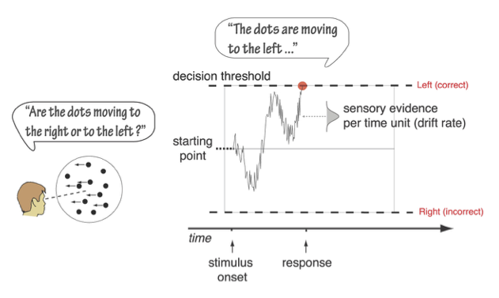
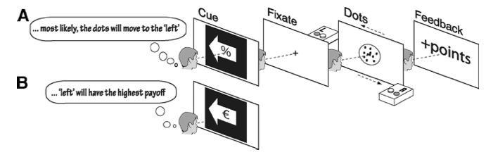
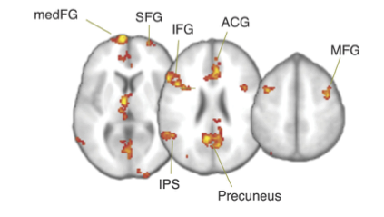

```{r load-packages, include=TRUE, warning=FALSE}
library(tidyverse)
library(viridis)

theme_set(theme_grey(base_size = 14) +
            theme(panel.grid = element_blank()))
```


# Entscheidungen

In der letzten Sitzung haben wir Daten aus einem Lexical Decision Task angeschaut, bei dem Versuchspersonen einen Stimulus in eine von zwei Antwortkategorien einteilen mussten. Dabei haben wir die Reaktionszeiten von korrekten Antworten angeschaut. Diese Art von Experimenten wird sehr häufig verwendet, und wird oft **choice response time** Task genannt. 

Wenn wir aber nur die korrekten Antworten betrachten, ignorieren wir sehr viel Information, die verwendet werden könnte, um etwas über die kognitiven Prozesse ausssagen zu können, welche dieser Art von Entscheidung zugrunde liegen könnten. Zum Beispiel wissen wir, dass die Fehler, welche Menschen in einer Speed-Stress Bedingung machen, schneller als korrekte Antworten sind, während in einer Accuracy-Stress Bedingung Fehler eher langsamer als korrekte Antworten sind. Solche Befunde sind schwierig zu erklären, ohne dass man dafür mathematische Modelle macht.

Aus diesem Grund hat Roger Ratcliff Ende der 70er Jahre das Diffusion Decision Modell (DDM=) entwickelt, welches eine Entscheidung zwischen zwei Alternativen in mehrere kognitive Komponenten zerlegt, und sowohl die Antworten als auch die Reaktionszeiten erklären kann [@ratcliffDiffusionDecisionModel2008b]. Auf seiner Website führt Ratcliff ine Liste von Anwendungen des DDM, z.B. für ADHS, Altern, Depression, etc.


# Diffusion Decision Model

Das von Ratcliff entwickelte Modell hat seinen Ursprung in Modellen zu den Bewegungen von Partikeln in einer Flüssigkeit, und geht auf Arbeiten von Albert Einstein und [Norbert Wiener](https://en.wikipedia.org/wiki/Norbert_Wiener) zurück. 

<aside>
Hier schauen wir uns eine vereinfachte Version dieses Modells an, welches nur 4 Parameter---im "standard" DDM hat es 7 Parameter.
</aside>

Die Grundidee ist, dass wir Evidenz für die eine oder die andere Antwortalternative brauchen, um eine Entscheidung zu treffen, und dass diese Evidenz über die Zeit akkumuliert wird. Diese Evidenz wird, je nach Task, von einem Teil unseres Gehirns verarbeitet, so dass sie für die Entscheidung zur Verfügung steht. Wenn wir beispielsweise eine perzeptuelle Entscheidung modellieren, wie etwa die Entscheidung, ob sich etwas nach rechts oder links bewegt, nehmen wir an, dass die Evidenz von den kortikalen Arealen verarbeitet wird, welche für Bewegungswahrnehmung zuständig sind. Diese Evidenz wird dann kontinuerlich einem Decision Process verfügbar gemacht, und zwar in Form einer Verteilung.


Wir nehmen nun an, dass wir die Zeit in diskrete kleine Intervalle $\Delta t$ einteilen können. Pro Zeiteinheit wird eine Zufallszahl aus dieser Evidenzverteilung gezogen wird, so dass positive Werte als Evidenz für die eine Antwortalternative gezählt wird, während negative Werte als Evidenz für die andere Antwortalternative gezählt wird. Diese Evidenz wird über die Zeit aufsummiert, bis entweder eine obere oder eine untere Grenze erreicht wird. Die aufsummierte Evidenz wird **Decision Variable** genannt. Ist eine der Grenzen erreicht, wird eine Antwort ausgelöst. Die Tendenz der Decision Variable, auf- oder abzusteigen, nennt man **drift rate**. Diese hat natürlich etwas mit dem Stimulus zu tun---je stärker der Stimulus, desto grösser wird die drift rate.

In Experimenten zum Bewegungssehen wird oft ein 'random dot motion' task verwendet. Hier muss entschieden werden, ob sich eine Punktwolke nach rechts oder nach links bewegt. Es wird hier angenommen, dass die drift rate von der Stimulusstärke abhängt; in diesem Fall ist das die Kohärenz, d.h. der Anteil der Punkte, welcher sich kohärent in eine Richtung bewegt.


```{r mulder, echo=FALSE, fig.cap = "Figure from @mulderBiasBrainDiffusion2012a",  layout="l-body-outset", fig.width=6, fig.height=5.}

```


Die Distanz zwischen den Grenzen wird **threshold** gennant, und der Anfangspunkt der Evidenzakkumulierung wird **bias** genannt. Die letzte wichtige Komponente dieses Modells ist die **non-decision time**. Darunter werden alle Prozesse zusammengefasst, welche ausgefährt werden müssen, jedoch nicht direkt mit der Entscheidung zu tun haben. Darunter fällt z.B. die Ausführung der Antwort durch das motorische System, aber auch die sensorische Verarbeitung. Wird dieser Entscheidungsprozess oft wiederholt, resultieren daraus Reaktionszeitverteilungen für korrekte und inkorrekte Entscheidungen.

```{r echo=FALSE, fig.cap = "Figure from @vindingVolitionProspectiveMemory2018",  layout="l-body-outset", fig.width=6, fig.height=5.}
knitr::include_graphics("images/ddm-illustration.png")
```


# Model in R

In R können wir die aktuelle Decision Variable zu Zeitpunkt $t$ als normalverteilte Zufallszahl modellieren, bei der die `driftrate` den Mittelwert der Evidenz repräsentiert, und `sd` die Standardabweichung.

```{r}
driftrate <- 0.5
sd <- 0.1
evidence <- rnorm(n = 1, mean = driftrate, sd = sd)
evidence
```

Dies bedeutet, dass zum Zeitpunkt $t$ die Evidenz ungefähr `r round(evidence, 2)` beträgt. Da die Evidenz die durchschnittliche Steigung repräsentiert, wird Evidenz $>0$ dazu führen, dass ein Schritt in Richtung der oberen Grenze gemacht wird. Wäre die Evidenz negativ, wird ein Schritt nach unten gemacht. Da die Evidenz aus einer Normalverteilung gezogen wird, ist es also möglich, dass die Evidenz zufällig negativ wird, obwohl die drift rate, d.h. die Repräsentation der Stimulusstärke, positiv ist.

<aside>
Es wird angenommen, dass dieser Aspekt einigermassen gut die Vorgänge im Gehirn abbildet, da die neuronalen Antworten auf einen Reiz variabel sind (dies bedeutet, dass Neurone immer unterschiedlich auf einen Reiz reagieren, auch wenn dieser gleich bleibt).
</aside>


Wenn wir dieses Prozess nun über einen Zeitraum wiederholen, und die `evidence` Werte aufsummieren, erhalten wir die *decision variable*. Diese sieht aus wie ein *random walk* mit einem Drift in die Richtung der durchschnittlichen Evidenz.

:::example
**Random walk simulieren**

Ein random walk ist das Resultat der Aufsummierung von Zufallszahlen. Probieren Sie es selber aus; simulieren Sie einen random walk mit 100 Zeitschritten. Fangen Sie bei $0$ an, ziehen Sie 99 normalverteilte Zufallszahlen und berechnen Sie die kumulierte Summe.  Plotten Sie das Resultat.


Dieser random walk hat keinen Trend, weil wir immer aus einer Normalverteilung mit Mittelwert $\mu=0$ ziehen. Wenn wir stattdessen aus einer Verteilung mit $\mu=0.1$ ziehen, erhalten wir einen positiven Trend.

```{r code_folding = TRUE}
set.seed(546)

# hier z.B> standardnormalverteilte Zahlen
zufallszahlen_1 <- c(0, rnorm(99, 0, 1))
random_walk_1 <- cumsum(zufallszahlen_1)
plot(1:100, random_walk_1, type = "s", col = "#7fc97f", 
     ylim=c(-10,30), lwd = 2, 
     xlab = "Zeit", ylab="Random Walk")

zufallszahlen_2 <- c(0, rnorm(99, 0.3, 1))
random_walk_2 <- cumsum(zufallszahlen_2)

lines(1:100, random_walk_2, pch = 18, col = "#beaed4", 
      type = "s", lwd = 2)

legend("topleft", legend=c("Ohne Trend", "Mit Trend"),
       col=c("#7fc97f", "#beaed4"), lty = c(1, 1))
```
:::


Die Evidenzakkumulierung wird analog modelliert. Wenn wir explizit die Zeitschritte als Iterationen aufschreiben, können wir dies in R mit einer `for` Loop machen.

```{r code_folding = TRUE}
n_steps <- 10
evidence <- rep(NA, n_steps)
dv <- rep(NA, n_steps)

time_steps <- 1:n_steps

# Wir ziehen den ersten Wert aus der Verteilung
evidence[1] <- rnorm(1, mean = driftrate, sd = sd)
dv[1] <- evidence[1]

# für jeden weitern Zeitpunkt ziehen wir wieder eine Zufallszahl und addieren zur kumulierten DV
for (t in 2:n_steps) {
    evidence[t] <- rnorm(1, mean = driftrate, sd = sd)
    dv[t] <- dv[t-1] + evidence[t]
}
```

```{r}
tibble(time_steps, evidence, dv) %>% 
    pivot_longer(c(evidence, dv), names_to = "type", values_to = "value") %>% 
    ggplot(aes(time_steps, value, linetype = type, color = type)) +
    geom_line() +
    geom_point(size = 4) +
    scale_color_viridis_d(begin = 0.2, end = 0.5)
```

Die Decision Variable `dv` repräsentiert nun die kumulierten Evidenz, aufgrund dessen das Gehirn eine Entscheiung treffen kann. Wenn die Decision Variable entweder grösser als die ober Grenze ist, oder kleiner als die untere Grenze, wird die Evidenzakkumulierung abgebrochen, und eine Antwort wird ausgelöst. Wir können nun noch die "non-decision time" hinzufügen, und den Anfangspunkt der Evidenzakkumulierung. Dieser Anfangspunkt ist ein sehr wichtiger Parameter, denn wenn der Anfagnspunkt nicht genau in der Mitte zwischen den beiden Grenzen liegt, dann braucht es natürlich weniger Evindenz, um die Grenze zu erreichen, welche näher beim Anfangspunkt liegt.

Anhand der folgenden Funktion lässt sich ein simpler Entscheidungsprozess simulieren, welcher alle wesentlichen Komponenten enthält: die `drift rate`, `boundary separation`, `bias` und die non-decision time `ndt`.

```{r code_folding=TRUE}
drift_diffusion <- function(bias = 0.5,
                            driftrate = 0.8,
                            decision_boundary = 2,
                            ndt = 0.5,
                            diffvar = 0.1,
                            dt = 0.001,
                            max_time = 6) {

    assertthat::assert_that(diffvar > 0)

    # rescale bias so that 0.5 lies halfway between upper and lower bound
    bias <- as.numeric(2 * decision_boundary * bias - decision_boundary)

    # initialize time_steps and dv
    time_steps <- max_time/dt
    dv <- array(dim = time_steps)

    # start acumulating from bias (starting point)
    dv[1] <- rnorm(1, mean = bias, sd = sqrt(dt))

    for (j in 2:time_steps) {

        # non-decision time
        if (j <= ndt/dt) {
            dv[j] <- dv[j-1]
        }
        else {
            error <- rnorm(1, 0, sqrt(diffvar * dt))
            dv[j] <- dv[j-1] + driftrate * dt + error  # Cobb & Zacks (1985), Eq. 1.14
            if (abs(dv[j]) > decision_boundary) {
                dv[j] <- dplyr::if_else(dv[j] > 0,
                                 min(dv[j], decision_boundary),
                                 max(dv[j], -decision_boundary))
                break()
            }
        }
    }
    d <- dplyr::tibble(time = round(seq_along(dv) * dt, 2),
                         dv = dv,
                         steps = seq_along(dv),
                         driftrate = driftrate,
                         decision_boundary = decision_boundary,
                         bias = bias,
                         ndt = ndt)
    return(d)
}
```


:::example
**Entscheidungsprozess in Pseudo-Code:**

Hier ist derselbe Algorithmus wie oben, aber in Pseudo-Code, anstelle von R Code.

1) Wähle einen Punkt zwischen Unter- und Obergrenze. Dieser Punkt ist der `bias`. Wenn dieser genau 0.5 ist, sind wir auf halben Weg zwischen den Grenzen.

2) Ziehe Evidenz aus einer Normalverteilung mit Mittelwert 0 und addiere die Differenz zwischen 0.5 und dem bias. Hier fangen wir mit der Akkumulierung an.

3) Warte bis die non-decision time vorbei ist.

4) Fange an, Evidenz aus einer Normalverteilung mit $\mu = \text{driftrate}$ zu ziehen. Addiere die aktuelle Evidenz zur akkumulierten decision variable.

5) Wiederhole dies, bis eine der Grenzen erreicht ist.

6) Entscheide dich für diejenige Alternative, dessen Grenze du erreicht hast.
:::


Wir können nun einige Trials plotten, um den Effekt dieser Parameter zu visualisieren.


```{r echo=FALSE}
library(kableExtra)
tribble(~Parameter, ~Bedeutung, ~Anwendung,
        "drift rate", "Qualität der Evidenz pro Zeiteinheit", "Task Schwierigkeit, Fähigkeit",
        "bias", "Anfangspunkt der Evidenzakkumulierung", "A priori Präferenz für eine der beiden Alternativen",
        "boundary separation", "Vorsicht (caution)", "Speed-Accuracy Trade-off",
        "non'decision time", "Verzögerung", "Periphere Prozesse") %>% 

  kbl() %>% 
  kable_styling(bootstrap_options = c("striped", "hover"))
```


## Drift rate

Wir fangen an mit der drift rate. Wenn diese $>> 0$ ist, wird die Obergrenze schnell erreicht, und es wir wenige Fehler geben. Ist die drift rate kleiner, aber immer noch $> 0$, wird die durschnittliche Zeit länger, um eine korrekte Antowort zu geben.

```{r code_folding=TRUE}
set.seed(829)

slow <- drift_diffusion(driftrate = 0.8) %>% mutate(type = "slow")
fast <- drift_diffusion(driftrate = 1.2) %>% mutate(type = "fast")

fastslow <- bind_rows(fast, slow) 

fastslow %>% 
    ggplot(aes(time, dv, color = type)) +
    geom_hline(yintercept = 0, linetype = 3) +
    geom_line() +
    scale_color_viridis_d(end = 0.8) +
    geom_hline(yintercept = c(-2, 2), color = "black", size = 1) +
    ggtitle("Grosse vs. kleine Drift Rate")
```

## Bias

Wenn der bias $>0.5$ ist, wird die Obergrenze schneller erreicht. Hier gibt es nun eine Interaktion mit der drift rate---ist diese klein, und der bias $<0.5$, ist die Chance, schnelle Fehler zu machen erhöht.

```{r code_folding = TRUE}
set.seed(29)

unbiased <- drift_diffusion(bias = 0.5) %>% mutate(type = "unbiased")
upbiased <- drift_diffusion(bias = 0.7) %>% mutate(type = "upbiased")
downbiased <- drift_diffusion(bias = 0.3) %>% mutate(type = "downbiased")


bias <- bind_rows(unbiased, upbiased, downbiased) 

bias %>% 
    ggplot(aes(time, dv, color = type)) +
    geom_hline(yintercept = 0, linetype = 3) +
    geom_line() +
    scale_color_viridis_d(end = 0.8) +
    geom_hline(yintercept = c(-2, 2), color = "black", size = 1) +
    ggtitle("Anfangspunkte")
```


## Boundary separation

Liegen die Grenzen weiter auseinander, braucht es mehr akkumulierte Evidenz, um eine der Grenzen zu erreichen. Dies führt dazu, dass weniger Fehler gemacht werden, da die zufällige Fluktuation über längere Zeit hinweg einen weniger starken Einfluss hat. Deshalb kann eine Verschiebung der Grenzen den Speed-Accuracy Trade-off erklären.


```{r code_folding = TRUE}
set.seed(84)

carefree <- drift_diffusion(decision_boundary = 1.6) %>% mutate(type = "carefree")
cautious <- drift_diffusion(decision_boundary = 2.1) %>% mutate(type = "cautious")

cautiouscareless <- bind_rows(carefree, cautious) 

decision_boundaries <- tribble(~type, ~decision_boundary,
                               "carefree", 1.6,
                               "cautious", 2.1)
cautiouscareless %>% 
    ggplot(aes(time, dv, color = type)) +
    geom_hline(yintercept = 0, linetype = 3) +
    geom_line() +
    scale_color_viridis_d(end = 0.8) +
    geom_hline(aes(yintercept = decision_boundary, color = type), data = decision_boundaries) +
    geom_hline(aes(yintercept = -decision_boundary, color = type), data = decision_boundaries) +
    ggtitle("Unterschiede im Abstand zwischen den Grenzen")
```

## Non-decision time

Eine Veränderung der non-decision time hat eine Auswirkung auf die durschnittliche Reaktionszeit, hat aber keinen Einfluss auf die Fehlerrate.


```{r code_folding = TRUE}
set.seed(4534)

longndt <- drift_diffusion(ndt = 0.7) %>% mutate(type = "longndt")
shortndt <- drift_diffusion(ndt = 0.2) %>% mutate(type = "shortndt")

ndt <- bind_rows(longndt, shortndt) 

ndts <- tribble(~type, ~ndt,
                "longndt", 0.7,
                "shortndt", 0.2)

ndt %>% 
    ggplot(aes(time, dv, color = type)) +
    geom_hline(yintercept = 0, linetype = 3) +
    geom_line() +
    scale_color_viridis_d(end = 0.8) +
    geom_vline(aes(xintercept = ndt, color = type), data = ndts) +
    geom_hline(yintercept = c(-2, 2), color = "black", size = 1) +
    ggtitle("Unterschiede in der Non-Decision Time")
```


# Simulationen


Die Verteilungsfunktion sind im R Package `rtdists` enthalten. Damit können zum Beispiel Zufallszahlen aus der DDM Verteilung ziehen, ohne dass wir den Prozess wie oben Schritt für Schritt modellieren müssen.


```{r}
library(rtdists)
```


Wir können so ein Experiment simulieren, bei dem die Fehler im Schnitt schneller als die korrekten Antworten sind, indem wir eine A Priori Präferenz für die Untergrenze definieren (`z = 0.2`).

Die 5 wichtigsten Argumente der Funktion sind:

```
n: Anzahl Zufallszahlen
a: boundary separation
v: drift rate
t0: non-decision time
z: bias
```


```{r}
rts <- rdiffusion(500, a = 1, v = 2, t0 = 0.5, z = 0.2)

glimpse(rts)
```

```{r}
head(rts)
```


```{r code_folding=TRUE}
rts %>% 
    ggplot(aes(rt, response, fill = response)) +
    geom_violin() +
    scale_fill_viridis_d(option = "B", direction = -1, 
                       begin = 1/3, end = 3/3)
```


```{r}
rts %>% 
    group_by(response) %>% 
    summarise(mean = mean(rt),
              median = median(rt),
              sd = sd(rt))
```


# Model-based Cognitive Neuroscience

@forstmannSequentialSamplingModels2016a bieten einen gut Überblick über Anwendungen des DDM in den Neurowissenschaften. Sie schreiben, dass die Verwendung eines kognitiven Prozessmodels sich besonders gut dafür eignet, individuelle Fähigkeiten zu messen, welche nicht durch die periphere Verarbeitung oder durch "response caution" kontaminiert ist. 

## Beispiele

- Altern: ältere Erwachsene sind oft langsamer als jüngere, machen aber nicht mehr Fehler. DDM Resultate haben gezeigt, dass es nicht immer kognitive Fähigkeiten sind, welche mit dem alter abnehmen, sondern oftmals periphere Prozesse und grössere Vorsicht. Dies konnte in Studien zu numerosity judgments, lexical decisions und recognition memory gezeigt werden.

- Arbeitsgedächtnis und IQ: ein höherer IQ geht mit einer grösserern drift rate einher. 

- Klinische Studien: Patienten mit Angststörungen haben eine höhere drift rate für bedrohliche Wörter/Bilder mit bedrohlichem Inhalt.

Anhand von DDM können Neuowissenschaftler Hirnmessungen mit kognitiven Prozessen assoziieren, anstelle von behavioralen "Effekten".  Folgende Studie ist ein gutes Beispiel einer solchen Studie, und gleichzeitig eine der ersten Model-based Neuroscience Studien.


## Bias in the Brain

@mulderBiasBrainDiffusion2012a haben untersucht, wie "prior knowledge" den Entscheidungsprozess in einem Random Dot Motion Task beeinflusst, und ob es ein neuronales Korrelat solchen Vorwissen gibt. Ein Beispielstrial ist weiter oben in diesem Kapitel dargestellt (siehe Figure \@ref(fig:mulder)).


Aus diesem Grund haben sie zwei verschieden Typen von Vorwissen benutzt. 

1) A Priori Wahrscheinlichkeit, dass die Punktwolke sich nach rechts oder nach links bewegte.
2) Asymmetrische Belohnung für  korrekte links/rechts Entscheidungen. 


```{r mulder-payoff, echo=FALSE, fig.cap = "Figure from @mulderBiasBrainDiffusion2012a",  layout="l-body-outset", fig.width=6, fig.height=5.}

```


Figure \@ref(fig:mulder-expected-results) zeigt schematisch die erwarteten Resultate. Für den Fall, dass der `starting point` im DDM betroffen ist, sind Reaktionszeiten schneller und die Fehlerrate kleiner, wenn das Vorwissen valide war. Bei invalidem Vorwissen sind die Fehler schneller, korrekte Entscheidungen sind langsamer, und die Fehlerrate ist erhöht.

Wenn die `draift rate` betroffen wäre, würde sich dies nur im Muster der Fehler manifestieren. Um also die neuronalen Korrelate von Vorwissen in perzeptuellen Entscheidungen zu untersuchen, ist es entscheidend, vorher zu demonstrieren, ob ein Parameter betroffen ist, der vor Beginn des Trials festegelegt wurde, oder ob die Akkumulation sensorischen Evidenz betroffen war, da anzunehmen war, dass die Prozesse in unterschiedlichen Hirnarealen ablaufen.


```{r mulder-expected-results, echo=FALSE, fig.cap = "Figure from @mulderBiasBrainDiffusion2012a",  layout="l-body-outset", fig.width=6, fig.height=5.}
knitr::include_graphics("images/exptected-results-mulder.png")
```


Die Resultate zeigent, dass die beiden Manipulationen von Vorwissen sich 1) nicht unterschieden, und 2) den `starting point` Parameter beeinflussten, und nicht die `drift rate`.


In Figure \@ref(fig:BOLD) sind die BOLD Responses der Areale welche besonder stark auf die "prior probability" (oben) und auf die "payoff" Manipulation (unten) reagierten.

Die Areale welche unabhängig der Art der Manipulation einen erhöhten BOLD Response zeigten waren der rechte MedFG (right medial frontal gyrus), ACG (anterior cingulate cortex), SFG (superior frontal gyrus), left middle temporal gyrus und IPS (intra-parietal sulcus). Die Autoren schlossen, dass diese Areale eine besondere Rolle in der Verarbeitung von Bias im Entscheidungsverhalten haben, und unabhängig davon, wie dieser Bias zustande kam.


```{r BOLD, echo=FALSE, fig.cap = "Figure from @mulderBiasBrainDiffusion2012a", fig.show="hold", out.width = "20%"}

knitr::include_graphics("images/BOLD-payoff.png")
```


Figure \@ref(fig:mulder-BOLD-startingpoint) zeigt die 5 Areale, deren Aktivität einen starken Zusammenhang mit den individuellen starting point Parametern hatte. 


```{r mulder-BOLD-startingpoint, echo=FALSE, fig.cap = "Figure from @mulderBiasBrainDiffusion2012a", out.width="50%"}
knitr::include_graphics("images/BOLD-starting-point.png")
```


### Fazit

Aufgrund der Verwendung eines kognitiven Prozessmodells konnten die Autoren das BOLD Signal mit den Auswirkungen der experimentellen Manipulation auf einen spezifischen Parameter untersuchten, anstatt lediglich den Zusammenhang zwischen BOLD Signal und Eigeschaften des Cues zu untersuchen. Dem starting point Parameter kann eine spezifische Rolle zugeschrieben werden---er repräsentiert die Stärke des a-priori Wissens, welches bereits vor der Evidenzakkumulierung existiert.

# DDM mit brms

Im letzten Teil wollen wir einen ähnlichen Datensatz wie aus dem @mulderBiasBrainDiffusion2012a Experiment mit einem DDM analysieren. Dies können wir mit einer Verteilung tun, welche in brms und Stan implementiert ist; die `wiener` Verteilung. Wir beschränken uns hier auf die Daten nur einer Versuchsperson aus einem fiktiven Experiment, welches eine Vereinfach des Mulder Experiments ist. Die Versuchsperson musste sich entscheiden, ob eine Punktwolke sich nach links oder nach rechts bewegte. Vor Beginn des Trials wurde jeweils ein Cue gezeigt in Form eines Pfeils, dessen Richtung entweder **kongruent** (valid cue) oder **inkongruent** (invalid cue) mit der Stimulusrichtung war. 


```{r}
library(tidyverse)
library(rtdists)
library(brms)
```

Wir generieren hier die Daten mit bekannten Parametern, damit wir wissen, ob wir diese rekonstruieren können. Die drift rate `v`, boundary separation `a` und non-decision time `ndt` bleiben in den beiden Bedingugen konstant. In der valid cue Bedingungen hat der starting point `z` den Wert $0.8$---in der invalid cue Bedingung den Wert $0.2$. Wir simulieren in jeder Bedingung 100 Trials.


```{r}
v <-  0.5  # average driftrate
a <- 1.0   # average boundary separation
ndt <- 0.3    # average non-decision time

ntrials <- 100 # 100 Trials pro Bedingung
```


```{r code_folding = TRUE}
d_valid<- tibble(rdiffusion(ntrials, a = a, v = v, z = 0.8, t0 = ndt),
                          cue = "valid")
d_invalid <- tibble(rdiffusion(ntrials, a = a, v = v, z = 0.2, t0 = ndt),
                          cue = "invalid")

d <- rbind(d_valid, d_invalid) %>% 
  mutate(cue = as_factor(cue))

glimpse(d)
```


```{r code_folding=TRUE}
d %>%
    mutate(response = ifelse(response == "upper", 
                             "correct", "error"),
           cue = ifelse(cue == "valid", "valid cue",
                        "invalid cue")) %>% 
    ggplot(aes(rt, fill = response)) +
    geom_density() +
    geom_rug() +
    scale_color_brewer(type = "qual") +
    scale_fill_brewer(type = "qual") +
    facet_grid(response ~ cue) +
  theme(legend.position = "none")
```

Die Daten zeigen den Effekt, dass die Fehler in der `valid cue` Bedingung langsamer als die korrekten Entscheidungen sind, während die Fehler in der `invalid cue` Bedingung schneller sind.


Wir wissen, dass sich zwischen den Bedingungen nur der `bias` verändert. Wenn wir die Daten jedoch nicht selber generieren, würden wir wahrscheinlich davon ausgehen, dass sich sowohl die `drift rate` als auch der `bias` zwischen den Bedingungen unterscheiden könnte.

Nun müssen wir beachten, dass die Wiener Verteilung in brms 4 Parameter hat, und wir zwei davon vorhersagen möchten. Deshalb verwenden wir die Funktion `bf()`, umd die verschiedenen Teile der Formel zu verbinden.

Der erste Teil, `rt | dec(response) ~ 0 + cue` bedeutet, dass wir den Erwartungswert der `drift rate` vohersagen, mit je einem Parameter für die beiden Bedingunen. Mit dem yweiten Teil, `bias ~ 0 + cue`, erreichen wir dasselbe für den `bias`.


```{r}
formula <- bf(rt | dec(response) ~ 0 + cue,
              bias ~ 0 + cue)
```


```{r}
get_prior(formula, family = wiener(), data = d) %>% 
  as_tibble() %>% 
  select(1:4)
```


Da wir hier sowohl die drafit rate als auch den bias mit einem linearen Modell vorhersagen, haben die Koeffizienten flache Prior. Wir benutzen lieber eigene Priors---in beiden Fällen Normalverteilungen mit $\mu = 0$ und $\sigma = 1$, da wir keine grossen Werte für die Parameter erwarten können.


```{r}
priors <- prior(normal(0, 1), class = b) +
    prior(normal(0, 1), class = b, dpar = bias)

```


```{r}
fit <- brm(formula,
            prior = priors,
            family = wiener(link = "identity", link_bias = "logit"),
            data = d,
            file = "models/ddm1")
```


```{r}
fit
```

```{r}
mcmc_plot(fit)
```

Die beiden Parameter `bias_cuevalid` und `bias_cueinvalid` sind auf der log-odds Skala. Deis bedeutet, dass Werte > 0 eine Präferenz für die Obergrenze darstellen. Wenn wir die Werte auf der bias-Skala (als Wert zwischen den Grenzen) haben wollen, müssen wir sie mit `plogis()` transformieren, genau wie bei der logistischen Regression.

Mit `fixef()` erhalten wir eine Zusammenfassung, welche wir wieder in Werte zwischen 0 und 1 konvertieren können.

```{r}
fixef(fit, pars = c("bias_cuevalid", "bias_cueinvalid")) %>% 
  plogis()
```


```{r}
conditional_effects(fit, effects = "cue", dpar = "mu")
```

```{r}
conditional_effects(fit, effects = "cue", dpar = "bias")
```


<aside>
Streng genommen ist dies nicht korrekt, denn eigentlich müssten wir die Posterior Samples zuerst transformieren, und erst dann zusammenfassen.
</aside>


## Resultat

Wir können die wahren `bias` Parameter ziemlich gut schätzen, aber aufgrund der wenigen Trials ist die Schätzung nicht sehr genau (100 Trials pro Bedingung sind für ein DDM nicht sehr viele). 

Ausserdem wird die drift rate unterschiedlich pro Bedingung geschätzt. Dies ist eher ungünstig, da wir wissen, dass nur der bias sich zwischen den Bedingungen geändert hat.

In einer Studie wäre es sinnvoller, zwei Modelle zu schätzen, eines davon mit unterschiedlichen drift rates, das andere mit unterschiedichen bias Parametern, und die beiden Modell dann zu vergleichen.


Wir schätzen hier den `bias` für diese Versuchsperson in den beiden Cue Bedingungen, und stellen fest, dass diesse Versuchsperson eine starke a priori Präferenz für korrekte Entscheidungen hat, wenn der Cue valide war, das heisst wenn die Richtungen des Pfeils und des Stimulus gleich waren. Wir könnten nun diese individuellen bias Parameter in einer fMRI Untersuchung benutzen, um herauszufinden, in welche Hirnregionen erhöhte BOLD Aktivität sich mit den personenspezifischen Parametern vorhersagen lässt. 
