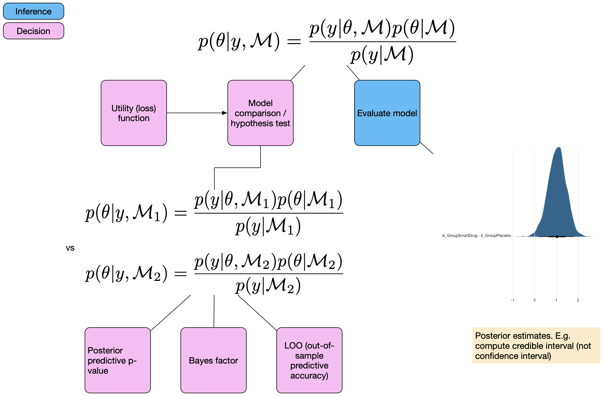
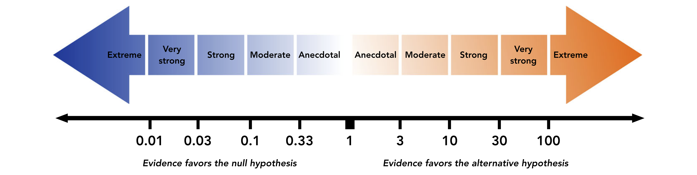

```{r child = "setup.Rmd"}
```

```{r load-packages}
library(tidyverse)
library(rmarkdown)
library(kableExtra)
library(countdown)

theme_set(theme_grey(base_size = 14) +
            theme(panel.grid = element_blank()))
```


## Einführung


.pull-left[
Bisher haben wir:

- Parameter geschätzt
    + Binomial (Bernoulli) Modell
    + Lineare Modelle mit kategorialem Prädiktor
- Posterior Verteilung(en) zusammengefasst
    + Credible Intervals
    + Highest Posterior Density Intervals

]

--

.pull-right[
Wir würden gerne Aussagen über die Wahrscheinlichkeiten von Modellen machen:

- z.B. Modell 1 (M1) erklärt die Daten besser als Modell 2 (M2).
- M1 ist wahrscheinlicher als M2

Solche Aussagen sind **Modellvergleiche**.
]


---

.pull-left[
.discussion[
Welche Methoden kennen Sie, um Modelle zu vergleichen?


- Diskutieren Sie anhand dieses Beispiels, wie Sie die Hypothese testen können, dass die Intervention einen Effekt hat.
]
]

.pull-right[


```{r include=FALSE}
library(tidyverse)
intervention <- rep(c('treat', 'control'), each = 5)
pre <- c(20, 10, 60, 20, 10, 50, 10, 40, 20, 10)
post <- c(70, 50, 90, 60, 50, 20, 10, 30, 50, 10)

dwide <- tibble(id = factor(1:10), 
            intervention, pre, post) %>% 
  mutate(diff = post - pre,
         id = as_factor(id), 
         intervention =  factor(intervention, levels = c("control", "treat")))
d <- dwide %>% 
  select(-diff) %>% 
  pivot_longer(cols = pre:post, names_to = "time", values_to = "score") %>% 
  mutate(time = as_factor(time))
```

Wir haben hier einen within (messwiederholten) Faktor (`time`), und einen between Faktor (`intervention`). 


```{r echo=FALSE, eval=TRUE}
d %>% 
  ggplot(aes(time, score, color = intervention)) +
  geom_line(aes(group = id), linetype = 1, size = 1) +
  geom_point(size = 4) +
  scale_color_viridis_d(end = 0.8) 
```


]

```{r echo=FALSE}
countdown(minutes = 3)
```

---

## Mögliche Methoden

- Hypothesentest, z.B.

.pull-left[
```{r eval=FALSE, include=TRUE}
t.test(diff ~ intervention,
       data = dwide)
```
]
.pull-right[
```{r eval=FALSE, include=TRUE}
m1 <- lmer(score ~ intervention + time + (1|id), 
                  data = d)
m2 <- lmer(score ~ intervention * time + (1|id), 
                  data = d)
```

]

- Modellvergleiche

    - Varianzaufklärung

    - Informationskriterien

    - Kreuzvalidierung

--

Wir lernen nun Methoden kennen, um mit Bayesianischen Modellen Modellvergleiche durchzuführen.

---

class: middle

.pull-left-narrow[
  .huge-blue-number[1]
]
.pull-right-wide[
  .larger[
  Theorie
  ]
]


---

## Bayesianische Modellvergleiche

Wir unterscheiden 3 verschiedene Methoden

1) Bayes Factors

2) Out of sample predictive accuracy:

> Approximate leave-one-out cross validation (LOO)

> Informationskriterien: widely application information criterion (WAIC)
    
3) Posterior predictive checking:
  > Konstruktion einer Teststatistik und Vergleich der aktuellen Daten mit generierten Daten aus der Posterior Predictive Distribution.

--

Heute schauen wir uns die erste Methode (Bayes Factors) an. Diese sind unter Statistikern sehr umstritten. Psychologen wollen Hypothesen testen (Evidenz für/gegen Hypothesen), während in anderen Bereichen dies weniger verbreitet ist.

---

.panelset[
.panel[.panel-name[Bayesian workflow]

```{r echo=FALSE, fig.height=5, fig.width=7}
knitr::include_graphics("images/Bayesian-workflow-1.png")
```

]

.panel[.panel-name[Posterior evaluation]

```{r echo = FALSE, out.width="80%"}

```

]

.panel[.panel-name[Model comparison]

```{r echo = FALSE, out.width="80%"}
knitr::include_graphics("images/Bayesian-workflow-3.png")
```

]
]

---

## Bayes factor

Bayes' Theorem, mit expliziter Abhängigkeit der Parameter $\mathbf{\theta}$  vom Modells $\mathcal{M}$:


$$ p(\theta | y, \mathcal{M}) = \frac{p(y|\theta, \mathcal{M}) p(\theta | \mathcal{M})}{p(y | \mathcal{M})}$$

$\mathcal{M}$ bezieht sich auf ein bestimmtes Modell. 

--

$p(y | \mathcal{M})$ ist die Wahrscheinlichkeit der Daten (marginal likelihood), über alle möglichen Parameterwerte des Modells $\mathcal{M}$ integriert. Wir haben sie anfangs als Normierungskonstante bezeichnet.

--

.panelset[
.panel[.panel-name[Bayes Theorem]

$$ P(\theta|Data) = \frac{ P(Data|\theta) * P(\theta) } {P(Data)} $$
]
.panel[.panel-name[Bayes Theorem ohne Konstante]
$$ P(\theta|Data) \propto P(Data|\theta) * P(\theta) $$
]
.panel[.panel-name[Marginal likelihood]

$$ p(y | \mathcal{M}) = \int_{\theta}{p(y | \theta, \mathcal{M}) p(\theta|\mathcal{M})d\theta} $$
Bei der Berechnung der Marginal Likelihood muss über alle unter dem Modell möglichen Werte von $\theta$ gemittelt werden.

]
]

---

## Komplexität

- Marginal Likelihood wird auch __Model Evidence__ genannt. Sie hängt davon ab, welche Vorhersagen ein Model machen kann (warum?).

- Ein Modell, welches viele Vorhersagen machen kann, ist ein __komplexes__ Modell. Die meisten Vorhersagen werden aber falsch sein (warum?).

--

Komplexität hängt unter anderem ab von:


- Anzahl Parameter im Modell

- Prior Verteilungen der Parameter

--

Bei frequentistischen Modellen spielt nur die Anzahl Parameter eine Rolle.


---

## Prior Verteilungen

Uninformative Priors machen viele Vorhersagen, vor allem in Gegenden des Parameterraums, in denen die Likelihood niedrig ist.


```{r}
n_points <- 100
theta_grid <- seq(from=0, to=1 , length.out = n_points)
likelihood <- dbinom(6, size = 9, prob = theta_grid)

compute_posterior = function(likelihood, prior){
  unstandardized_posterior <- likelihood * prior
  posterior <- unstandardized_posterior / sum(unstandardized_posterior)
  par(mfrow=c(1, 3))
  plot(theta_grid , prior, type="l", main="Prior", col = "dodgerblue3", lwd = 2)
  plot(theta_grid , likelihood, type="l", main="Likelihood", col = "firebrick3", lwd = 2)
  plot(theta_grid , posterior , type="l", main="Posterior", col = "darkorchid3", lwd = 2)
}
```

---

## Prior Verteilungen

Uninformative Priors machen viele Vorhersagen, vor allem in Gegenden des Parameterraums, in denen die Likelihood niedrig ist.

.panelset[
.panel[.panel-name[Uniformer Prior]
```{r}
prior <- dbeta(x = theta_grid, shape1 = 1, shape2 = 1)
compute_posterior(likelihood, prior)
```
]

.panel[.panel-name[Informativer Prior]

```{r}
prior <- dbeta(x = theta_grid, shape1 = 20, shape2 = 20)
compute_posterior(likelihood, prior)
```
]

.panel[.panel-name[Opiniated Prior (falsch)]

```{r}
prior <- dbeta(x = theta_grid, shape1 = 2, shape2 = 40)
compute_posterior(likelihood, prior)
```
]

.panel[.panel-name[Opiniated Prior (besser)]

```{r}
prior <- dbeta(x = theta_grid, shape1 = 48, shape2 = 30)
compute_posterior(likelihood, prior)
```
]
]


---

## Ockham's Razor

- Komplexe Modelle haben eine niedrigere Marginal Likelihood.

- Wenn wir bei einem Vergleich mehrerer Modelle diejenigen Modelle mit höherer Marginal Likelihood bevorzugen, wenden wir das __Prinzip der Sparsamkeit__ an.


--


Wir schreiben Bayes Theorem mit expliziten Modellen M1 und M2


$$ p(\mathcal{M}_1 | y) = \frac{P(y | \mathcal{M}_1) p(\mathcal{M}_1)}{p(y)} $$

und

$$ p(\mathcal{M}_2 | y) = \frac{P(y | \mathcal{M}_2) p(\mathcal{M}_2)}{p(y)} $$


--

Für Model $\mathcal{M_m}$ ist die Posterior Wahrscheinlichkeit des Modells proportional zum Produkt der Marginal Likelihood und der A Priori Wahrscheinlichkeit.


---

## Modellvergleich


Verhältnis der Modellwahrscheinlichkeiten:

$$ \frac{p(\mathcal{M}_1 | y) = \frac{P(y | \mathcal{M}_1) p(\mathcal{M}_1)}{p(y)}} {p(\mathcal{M}_2 | y) = \frac{P(y | \mathcal{M}_2) p(\mathcal{M}_2)}{p(y)}} $$

--

$p(y)$ kann rausgekürzt werden.


--


$$\underbrace{\frac{p(\mathcal{M}_1 | y)} {p(\mathcal{M}_2 | y)}}_\text{Posterior odds} = \frac{P(y | \mathcal{M}_1)}{P(y | \mathcal{M}_2)} \cdot \underbrace{ \frac{p(\mathcal{M}_1)}{p(\mathcal{M}_2)}}_\text{Prior odds}$$

--

<br>

$\frac{p(\mathcal{M}_1)}{p(\mathcal{M}_2)}$ sind die  **prior odds**, und $\frac{p(\mathcal{M}_1 | y)}{p(\mathcal{M}_2 | y)}$ sind die **posterior odds**.


---


Nehmen wir an, die Prior Odds seine $1$, dann interessiert uns nur das Verhältnis der Marginal Likelihoods:

$$ \frac{P(y | \mathcal{M}_1)}{P(y | \mathcal{M}_2)} $$

--

Dieser Term ist der **Bayes factor**: der Term, mit dem die Prior Odds multipliziert werden. Er gibt an, unter welchem Modell die Daten wahrscheinlicher sind.


Wir schreiben $BF_{12}$ - dies ist der Bayes factor für Modell 1 vs Modell 2.

$$ BF_{12} = \frac{P(y | \mathcal{M}_1)}{P(y | \mathcal{M}_2)}$$


--


$BF_{12}$ gibt an, in welchem Ausmass die Daten $\mathcal{M}_1$ bevorzugen, relativ zu $\mathcal{M}_2$.

Beispiel: $BF_{12} = 5$ heisst: die Daten sind unter Modell 1 5 Mal wahrscheinlicher als unter Modell 2 


---

## Klassifizierung

```{r echo = FALSE, out.width="80%"}
  
```


---

## Bayes Factor

- Sehr stark abhängig von den Prior Verteilungen der Parameter.

- Ist nur für sehr simple Modelle einfach zu berechnen/schätzen.

- Schätzmethoden
    + Savage-Dickey Density Ratio mit `Stan`/`brms`
    
    + Package [BayesFactor](https://cran.r-project.org/web/packages/BayesFactor/vignettes/manual.html) (nur für allgemeine lineare Modelle)
    
    + [JASP](https://jasp-stats.org/): Im Prinzip ein GUI für `BayesFactor`
    
    + Bridge sampling mit `brms`: schwieriger zu implementieren, aber für viele Modelle möglich.


---

class: middle

.pull-left-narrow[
  .huge-blue-number[2]
]
.pull-right-wide[
  .larger[
  Anwendung: Binomial Model
  ]
]


---


## Savage-Dickey Density Ratio


Wenn wir zwei genestete Modell vergleichen, wie z.B. ein Modell 1 mit einem frei geschätzten Parameter, und ein Nullmodell 
vergleichen, gibt es eine einfache Methode.


Unter dem Nullmodell (Nullhypothese): $H_0: \theta = \theta_0$

Unter Modell 1: $H_1: \theta \neq \theta_0$

--

Nun braucht der Parameter $\theta$ unter Modell 1 eine Verteilung, z.B. $\theta \sim \text{Beta}(1, 1)$

--

Der Savage-Dickey Density Ratio Trick: wir betrachten nur Modell 1, und dividieren die Posterior Verteilung durch die Prior Verteilung an der Stelle $\theta_0$.

.footnote[
Beim Nullmodell ist der Parameter auf den Wert 0 fixiert.
]


---

## Savage-Dickey Density Ratio

Wir schauen uns ein Beispiel aus Wagenmakers (2010) an:


Sie beobachten, dass jemand 9 Fragen von 10 richtig beantwortet. 

```{r}
d <- tibble(s = 9, k = 10)
```


Unsere Frage: was ist die Wahrscheinlichkeit, dass das mit Glück ( $\theta = 0.5$ ) passiert ist?


.footnote[
Wagenmakers, Eric-Jan, Tom Lodewyckx, Himanshu Kuriyal, and Raoul Grasman. “Bayesian Hypothesis Testing for Psychologists: A Tutorial on the Savage–Dickey Method.” Cognitive Psychology 60, no. 3 (May 1, 2010): 158–89. https://doi.org/10.1016/j.cogpsych.2009.12.001.
]

---


.panelset[
.panel[.panel-name[Prior]
```{r echo=FALSE}
pd <- tibble(
  x = seq(0, 1, by = .01),
  Prior = dbeta(x, 1, 1)
)
ggplot(pd, aes(x, Prior)) +
  geom_line(size = 1.5) +
  coord_cartesian(xlim = 0:1, ylim = c(0, 6), expand = 0.01) +
  labs(y = "Density", x = bquote(theta))
```
]


.panel[.panel-name[Posterior]

```{r echo=FALSE, preview=TRUE}
pd <- pd %>% 
  mutate(Posterior = dbeta(x, 9+1, 1+1))

pdw <- pd %>% 
  pivot_longer(names_to = "Type", 
               values_to = "density", 
               Prior:Posterior)
pdw %>% 
  ggplot(aes(x, density, col = Type)) +
  geom_line(size = 1.5) +
  scale_x_continuous(expand = expansion(0.01)) +
  scale_color_viridis_d(end = 0.8) +
  labs(y = "Density", x = bquote(theta)) +
  annotate("point", x = c(.5, .5), 
           y = c(pdw$density[pdw$x == .5]),
           size = 4) +
  annotate("label",
    x = c(.5, .5),
    y = pdw$density[pdw$x == .5],
    label = round(pdw$density[pdw$x == .5], 3),
    vjust = -.5
  )
```


```{r echo = FALSE}
filter(pd, x == .5) %>%
  mutate(
    BF01 = Posterior / Prior,
    BF10 = 1 / BF01
  ) %>%
  kable(caption = "Bayes Factors.", digits = 3) %>% 
  kable_styling(full_width = FALSE)
```
]
]


---

## Savage-Dickey Density Ratio 


.panelset[
.panel[.panel-name[Formula]


```{r message=FALSE, warning=FALSE}
library(brms)

m1_formula <- bf(
  s | trials(k) ~ 0 + Intercept,
  family = binomial(link = "identity"))
```

]

.panel[.panel-name[Get Priors]

```{r, message = F}
get_prior(m1_formula, 
          data = d)
```
]
.panel[.panel-name[Set Priors]

```{r}
priors <- set_prior("beta(1, 1)", 
                   class = "b", 
                   lb = 0, ub = 1)
```

]

.panel[.panel-name[Posterior]

```{r, results='hide'}
m1 <- brm(m1_formula,
         prior = priors,
         data = d,
         sample_prior = TRUE, #<<
         file = "models/05-m1")
```

]
.panel[.panel-name[Summary]

```{r}
summary(m1)
```

]
]

---

## Posterior summary

```{r}

m1 %>% 
  mcmc_plot(c("b_Intercept", "prior_b"))
```


---

## Prior und Posterior

.pull-left[
```{r echo = 1}
samples <- m1 %>% 
  posterior_samples("b")

head(samples) %>% 
  kable(digits = 2, caption = "Six first rows of posterior samples.") %>% 
  kable_styling(full_width = FALSE)

```

]

.pull-right[

```{r}
samples %>% 
  pivot_longer(everything(), 
               names_to = "Type", 
               values_to = "value") %>%
  ggplot(aes(value, color = Type)) +
  geom_density(size = 1.5) +
  scale_color_viridis_d(end = 0.8) +
  labs(x = bquote(theta), y = "Density") +
  geom_vline(xintercept = .9) 
```

]

---

## Savage-Dickey Density Ratio 

### Mit `brms`


```{r echo = -1}
options(width = 120)

h <- m1 %>% 
  hypothesis("Intercept = 0.5")

print(h, digits = 4)
```


---

## Savage-Dickey Density Ratio 

```{r}
plot(h)
```


---

class: middle

.pull-left-narrow[
  .huge-blue-number[3]
]
.pull-right-wide[
  .larger[
  Anwendung: Normalverteilung
  ]
]


---

## Bayes Factor für Vergleich von zwei Mittelwerten

```{r}
smart = tibble(IQ = c(101,100,102,104,102,97,105,105,98,101,100,123,105,103,
                      100,95,102,106,109,102,82,102,100,102,102,101,102,102,
                      103,103,97,97,103,101,97,104,96,103,124,101,101,100,
                      101,101,104,100,101),
               Group = "SmartDrug")

placebo = tibble(IQ = c(99,101,100,101,102,100,97,101,104,101,102,102,100,105,
                        88,101,100,104,100,100,100,101,102,103,97,101,101,100,101,
                        99,101,100,100,101,100,99,101,100,102,99,100,99),
                 Group = "Placebo")

TwoGroupIQ <- bind_rows(smart, placebo)  %>%
    mutate(Group = fct_relevel(as.factor(Group), "Placebo"))
```


---

```{r}
t.test(IQ ~ Group,
       data = TwoGroupIQ)
```


---

.panelset[
.panel[.panel-name[Formula]

```{r}
m2_formula <- bf(IQ ~ 1 + Group)
```

]

.panel[.panel-name[Get Priors]


```{r}
get_prior(m2_formula,
          data = TwoGroupIQ)
```
]

.panel[.panel-name[Set Priors]

```{r}
priors = c(set_prior("normal(0, 1)",
                    class = "b", coef = "GroupSmartDrug"))
```

]

.panel[.panel-name[Posterior]

```{r}
m2 <- brm(m2_formula,
          prior = priors,
          data = TwoGroupIQ,
          cores = parallel::detectCores(),
          sample_prior = TRUE,
          file = here::here("models/05-m2-iq-bf"))
```


]

.panel[.panel-name[Summary]

```{r}
summary(m2)
```
]
]

---

```{r}
m2 %>% 
  mcmc_plot("GroupSmartDrug")
```

---


```{r}
BF <- hypothesis(m2,
                hypothesis = 'GroupSmartDrug = 0')

BF
```


```{r}
1/BF$hypothesis$Evid.Ratio
```


---

.your-turn[
Speichern Sie den Dataframe mit der Funktion `write_csv()` `TwoGroupIQ` als `CSV` File.

```{r eval=FALSE, include=TRUE}
write_csv(TwoGroupIQ, file = "SmartDrug.csv")
```

Laden Sie [JASP](https://jasp-stats.org/download/) herunter, und öffnen Sie das gespeicherte CSV File.

Führen Sie in JASP einen **Bayesian t-Test** durch. 

- Warum erhalten Sie nicht denselben Bayes Factor wie JASP?
- Probieren Sie verschiedene Prior Verteilungen aus.
- Versuchen Sie, das Ergebnis in Worten zusammenzufassen. Was sagt der Bayes Factor aus?
]
