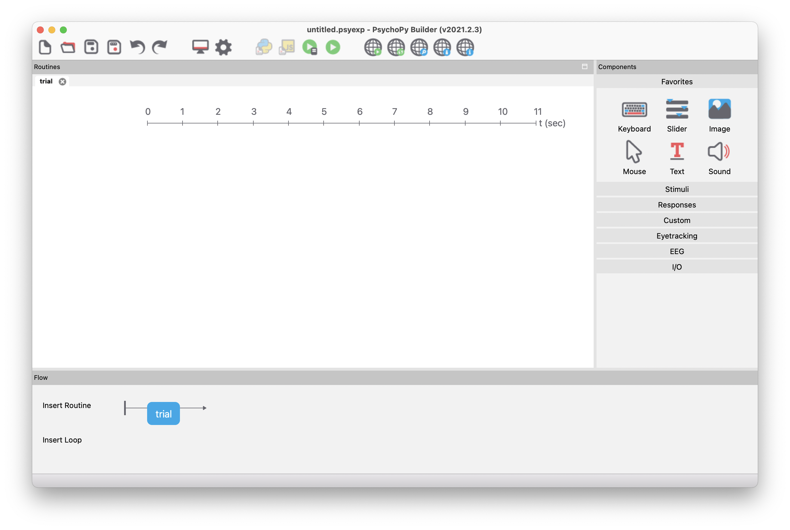

```{r child = "setup.Rmd"}
```

```{r load-packages, include=FALSE, warning=FALSE}
library(tidyverse)
library(rmarkdown)
library(countdown)
```


class: middle

.pull-left-narrow[
  .huge-blue-number[1]
]
.pull-right-wide[
  .larger[
    Bias RDK Experiment
  ]
]

---

## Bias RDK Experiment

.pull-left[
- Random-dot motion direction-discrimination task

- Inside/outside scanner (timing)

- Bias: cue (probability left/right/unbiased)

- Fixation cross

- RDK: 3x3 pixels, coherence 

- 40 bias trials, 40 neutral trials

- 32 valid, 8 invalid trials
]

.pull-right[
```{r echo=FALSE, fig.height=5, fig.width=7}
knitr::include_graphics("images/bias-payoff-mulder.png")
```
]

---


class: middle

.pull-left-narrow[
  .huge-blue-number[2]
]
.pull-right-wide[
  .larger[
    PsychoPy
  ]
]

---

## PsychoPy

.pull-left-narrow[
- [PsychoPy Website](https://www.psychopy.org/)

- [Ressourcen](https://workshops.psychopy.org/teaching/index.html)

- [Walk-through: Builder](https://tu-coding-outreach-group.github.io/cog_summer_workshops_2021/psychopy/index.html)

- [Diskussionsforum](https://discourse.psychopy.org/)

- Kapitel: [Verhaltensexperiment mit PsychoPy](../behavioural-experiments.html)
]

.pull-right-wide[

```{r echo=FALSE, fig.height=7.5, fig.width=10.5}

```
]


---

class: middle

.pull-left-narrow[
  .huge-blue-number[3]
]
.pull-right-wide[
  .larger[
    Pavlovia
  ]
]

---

## Pavlovia


- [Pavlovia](https://pavlovia.org/#main): 

> Pavlovia is a place for the wide community of researchers in the behavioural sciences to run, share, and explore experiments online.

- [Experimente](https://pavlovia.org/explore?sort=DEFAULT) suchen.

- Zum Beispiel [ChoiceRTT](https://pavlovia.org/explore?sort=DEFAULT) ausprobieren und den [Code](https://gitlab.pavlovia.org/demos/choicertt) anschauen.


---

class: middle

.pull-left-narrow[
  .huge-blue-number[4]
]
.pull-right-wide[
  .larger[
    Understanding your Computer
  ]
]

---

## Understanding your Computer


- Refresh rate: 60 Hz. Ein Frame dauert 1/60 Sekunde, oder 16.667 ms.

```
from psychopy import visual

win = visual.Window()
win.getActualFrameRate()
```

- Keyboard timing: Variabilität ~15 ms.

- Screen refresh fängt oben an und endet (~10 ms später) unten .


---

class: middle

.pull-left-narrow[
  .huge-blue-number[5]
]
.pull-right-wide[
  .larger[
    🛠 Selber machen
  ]
]

---

## Probieren Sie es selber!

.your-turn[
Versuchen Sie selber, Teile des Experiments in PsychoPy zu implementieren
]

- Wenn Sie eine Starthilfe benötigen, downloaden Sie ein Beipiel: 👉 [Practice Trials](../files/PracticeTrials.zip)

- Eine Einführung finden Sie hier: 👉 [Verhaltensexperiment mit PsychoPy](../behavioural-experiments.html)
 

```{r echo=FALSE}
countdown(minutes = 25)
```

