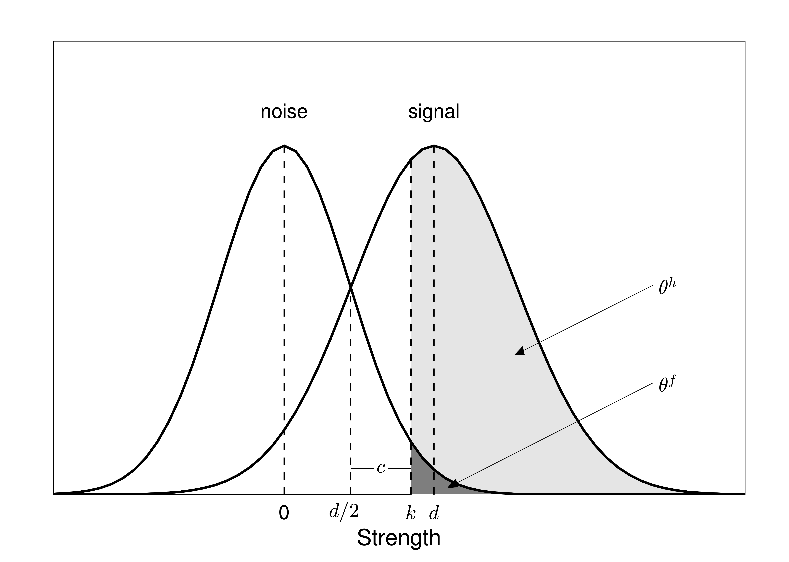

```{r child = "setup.Rmd"}
```

```{r load-packages, include=FALSE, warning=FALSE}
library(tidyverse)
library(rmarkdown)
library(countdown)
```


class: middle

.pull-left-narrow[
  .huge-blue-number[1]
]
.pull-right-wide[
  .larger[
    Signal Detection Theory
  ]
]

---

## Signal detection theory


- What happpens when a person must whether or not an event has occured, using information that insufficient to determine the answer?

- Signal detection theory is a widely-used method for analyzing this type of situation and of separating characteristics of the signal from those of the person who is detecting it.

- We can begin to investigate how information is used to guide a decision.


---

## Signal detection theory

.pull-left[
**What is a decision?**

- A doctor is examining a patient and trying to make a diagnosis.

- A witness to a crime is asked to identify a suspect. Was this person present at the time of the crime or not?

- Purchase decision, gambling decisions, perceptual decisions, etc.
]


--


.pull-right[
**Binary choice**

|              | **Signal**     |                        |
| ------------ | -------------- | ---------------------- |
| **Response** | Yes            | No                 |
| --------     | -------------- | ---------------------  |
| Yes          | Hit            | False alarm (FA)       |
| No           | Miss           | Correct rejection (CR) |
]

---

## Signal detection theory

.panelset[
.panel[.panel-name[Assumptions of SDT]

**The key assumptions of SDT**

- Separate representation and decision-making.

- Signal and noise trials can be represented as values along a uni-dimensional “strength” construct.

- Both types trials produce Gaussian random variables that represent strength. 

- Both variances are assumed to be the same.

- The decision-making assumption of is that yes and no responses are produced by comparing the strength of the current trial to a fixed criterion. If the strength exceeds the criterion a “yes” response is made, otherwise a “no” response is made.
]


.panel[.panel-name[Graphical representation]


```{r sdtmodel, echo = FALSE, out.width = "55%", fig.cap="Equal-variance Signal Detection Model"}

```

]
]


---

## `c` and `d'`

```{r sdtmodel-2, echo = FALSE, out.width = "33%"}

```

- The mean of the signal distribution is `d'`. This makes `d'` a measure of the discriminability of the signal trials from the noise trials -- it corresponds to the distance between the two distributions.

- The strength value `d/2` is special, because it is the criterion value that maximizes the probability of a correct classification when signal and noise trials are equally likely to occur.

- `c` a measure of bias, because it corresponds to how different the actual criterion is from the unbiased one. Positive values of c correspond to a bias towards saying no, and so to an increase in correct rejections at the expense of an increase in misses. Negative values of c correspond to a bias towards saying yes, and so to an increase in hits at the expense of an increase in false alarms.


---


class: middle

.pull-left-narrow[
  .huge-blue-number[2]
]
.pull-right-wide[
  .larger[
    Computing Signal Detection Measures in R
  ]
]

---

## Computing Signal Detection Measures in R


.panelset[
.panel[.panel-name[Distribution function: code]

```{r,  echo=TRUE, eval=FALSE}
library(tidyverse)
tibble(x = seq(-3, 3, by = 0.1)) %>% 
  ggplot(aes(x)) +
  stat_function(fun = pnorm, colour = "steelblue3", 
                  args = list(mean = 0, sd = 1),
                  size = 1.5) +
  labs(y = "Probability", x = "Z Score") +
  scale_y_continuous(limits = c(0, 1)) +
  scale_x_continuous(limits = c(-3.5, 3.5), breaks = -3:3) + 
  ggtitle("Cumulative distribution function / pnorm()") +
  theme_linedraw()
```
]

.panel[.panel-name[Distribution function: figure]
```{r,  echo=FALSE, eval=TRUE}
library(tidyverse)
tibble(x = seq(-3, 3, by = 0.1)) %>% 
  ggplot(aes(x)) +
  stat_function(fun = pnorm, colour = "steelblue3", 
                  args = list(mean = 0, sd = 1),
                  size = 1.5) +
  labs(y = "Probability", x = "Z Score") +
  scale_y_continuous(limits = c(0, 1)) +
  scale_x_continuous(limits = c(-3.5, 3.5), breaks = -3:3) + 
  ggtitle("Cumulative distribution function / pnorm()") +
  theme_linedraw()
```

Cumulative distribution function: `pnorm()`

]
]

---


.panelset[
.panel[.panel-name[Quantile function: code]

```{r,  echo=TRUE, eval=FALSE}
tibble(x = seq(0, 1, by = 0.01)) %>% 
  ggplot(aes(x)) +
  stat_function(fun = qnorm, colour = "steelblue3", 
                  args = list(mean = 0, sd = 1),
                  size = 1.5) +
  labs(x = "Probability", y = "Z Score") +
  scale_x_continuous(limits = c(0, 1)) +
  scale_y_continuous(limits = c(-3.5, 3.5), breaks = -3:3) + 
  ggtitle("Probit function / quantile function / inverse cdf / qnorm()") +
  theme_linedraw()
```
]

.panel[.panel-name[Quantile function: figure]
```{r,  echo=FALSE, eval=TRUE}
tibble(x = seq(0, 1, by = 0.01)) %>% 
  ggplot(aes(x)) +
  stat_function(fun = qnorm, colour = "steelblue3", 
                  args = list(mean = 0, sd = 1),
                  size = 1.5) +
  labs(x = "Probability", y = "Z Score") +
  scale_x_continuous(limits = c(0, 1)) +
  scale_y_continuous(limits = c(-3.5, 3.5), breaks = -3:3) + 
  ggtitle("Probit function / quantile function / inverse cdf / qnorm()") +
  theme_linedraw()
```

Probit function / quantile function / inverse cdf: `qnorm()`


]
]

---


class: middle

.pull-left-narrow[
  .huge-blue-number[3]
]
.pull-right-wide[
  .larger[
    Using Signal Detection to Analyze Data in R
  ]
]

---

## Using Signal Detection to Analyze Data in R

We will look at an example using data from a recognition memory test.

- Subjects first learn words (study phase).

- In the test phase, they are presented with words that were on the list, and with new words.

- Subjects have to classify words into 
    + `old` (yes, this was on the list) 
    + `new` (no, this wasn't on the list)
    
- These kind of data are usually analyzed using a Signal Detection model.
