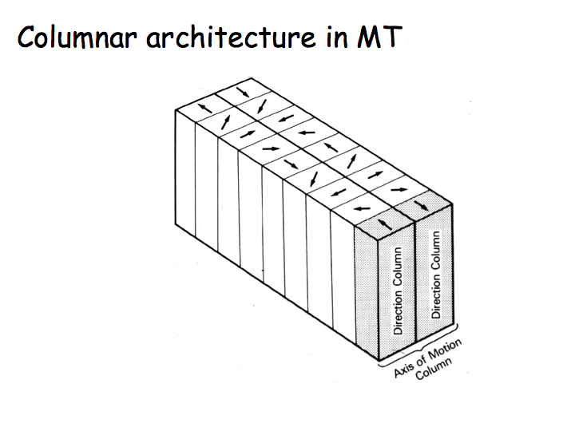
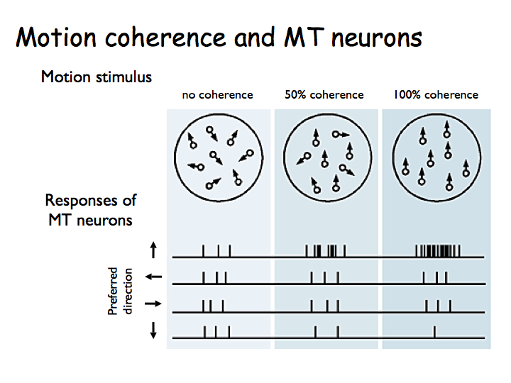
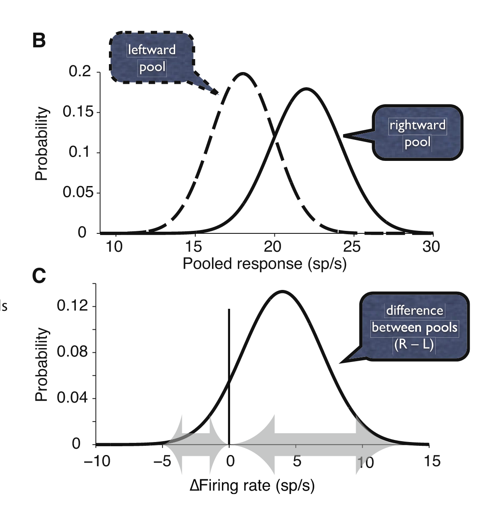
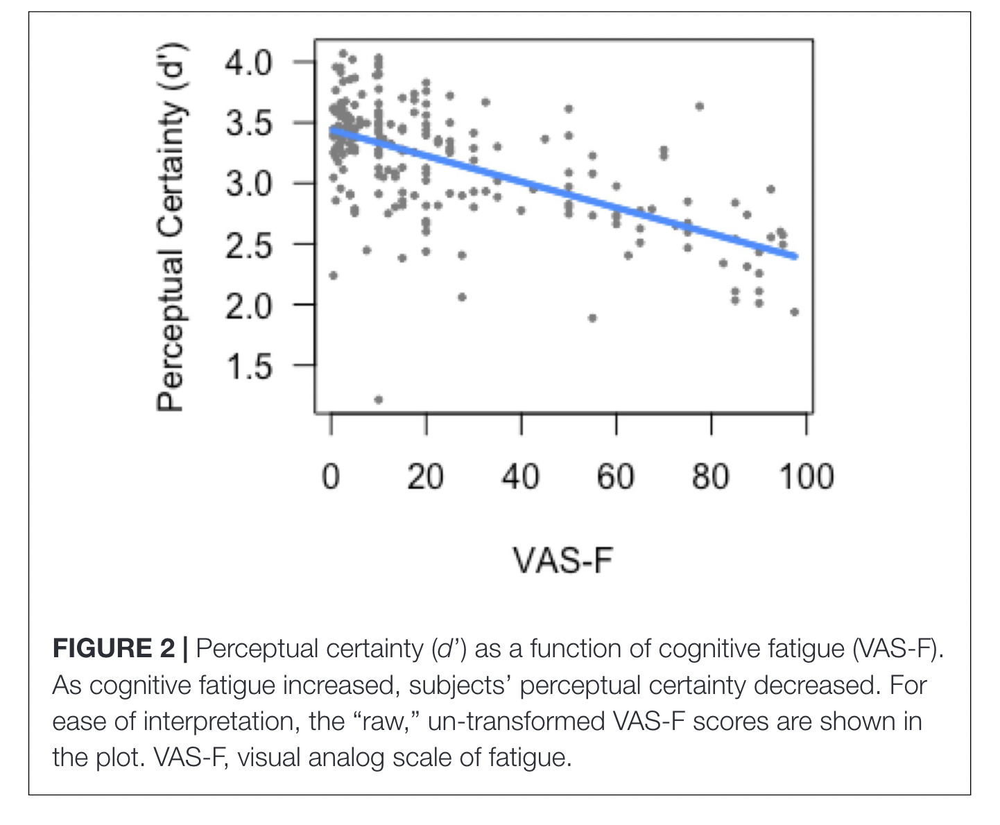
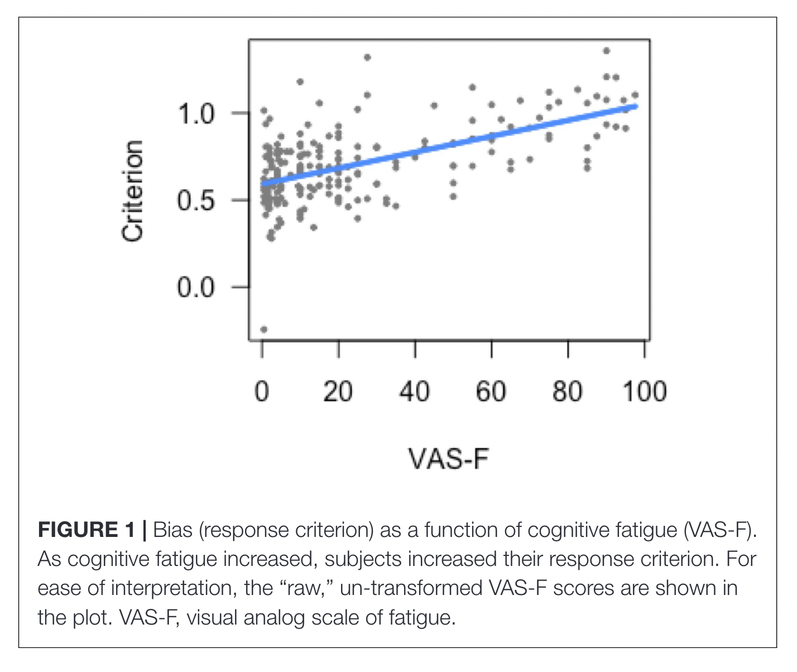
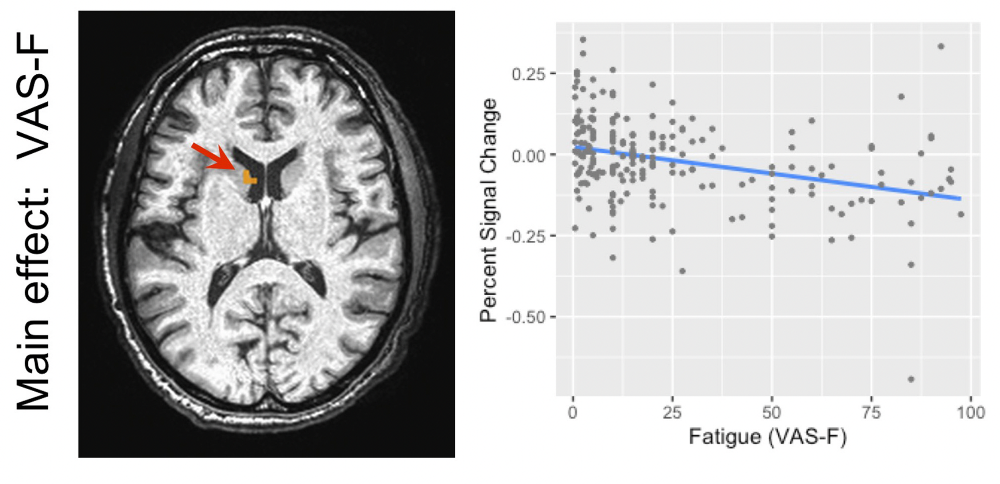

```{r child = "setup.Rmd"}
```

```{r load-packages, include=FALSE, warning=FALSE}
library(tidyverse)
library(rmarkdown)
library(countdown)
```


class: middle

.pull-left-narrow[
  .huge-blue-number[1]
]
.pull-right-wide[
  .larger[
    Visual Motion
  ]
]

---

## Visual Motion

Decision variable: Lateral Intraparietal Cortex (LIP)

.pull-left[

```{r echo = FALSE, out.width = "55%"}

```

```{r echo = FALSE, out.width = "55%"}

```
]

.pull-right[

```{r echo = FALSE, out.width = "55%"}

```

]


Shadlen, M. N., & Kiani, R. (2013). Decision Making as a Window on Cognition. Neuron, 80(3), 791–806. https://doi.org/10.1016/j.neuron.2013.10.047

---


class: middle

.pull-left-narrow[
  .huge-blue-number[2]
]
.pull-right-wide[
  .larger[
    Cognitive Fatigue
  ]
]

---

## Cognitive Fatigue


- When we are fatigued, we feel that our performance is worse than when we are fresh.

- The metrics of signal detection theory (SDT)—response bias (criterion) and perceptual certainty (d’) may change as a function of fatigue, but no work has yet been done to examine whether these metrics covary with fatigue.

- We induced fatigue through repetitive performance of the n-back working memory task, while functional magnetic resonance imaging (fMRI) data was acquired.

- Our results show that both criterion and d’ were correlated with changes in cognitive fatigue: as fatigue increased, subjects became more conservative in their response bias and their perceptual certainty declined. Furthermore, activation in the striatum of the basal ganglia was also related to cognitive fatigue, criterion, and d'.

- The following behavioral data were analyzed: overall accuracy, the reaction times (RTs) of the correct trials, and signal detection metrics.

- Participants were presented with a visual analog scale (VAS) before and after each block. Participants were asked: “How mentally fatigued are you right now?”


Wylie, G. R., Yao, B., Sandry, J., & DeLuca, J. (2020). Using Signal Detection Theory to Better Understand Cognitive Fatigue. _Frontiers in Psychology_, _11_, 579188. 
[https://doi.org/10.3389/fpsyg.2020.579188](https://doi.org/10.3389/fpsyg.2020.579188)

---


## Cognitive Fatigue

.pull-left[

```{r echo = FALSE, out.width = "55%"}

```

```{r echo = FALSE, out.width = "55%"}

```
]

.pull-right[

```{r echo = FALSE, out.width = "55%"}

```

```{r echo = FALSE, out.width = "55%"}
knitr::include_graphics("images/fatigue-brain-c.png")
```

]
