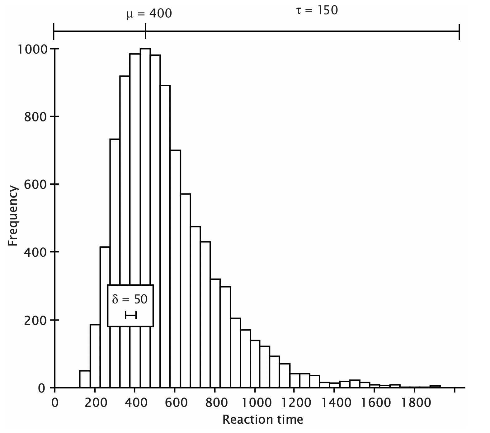
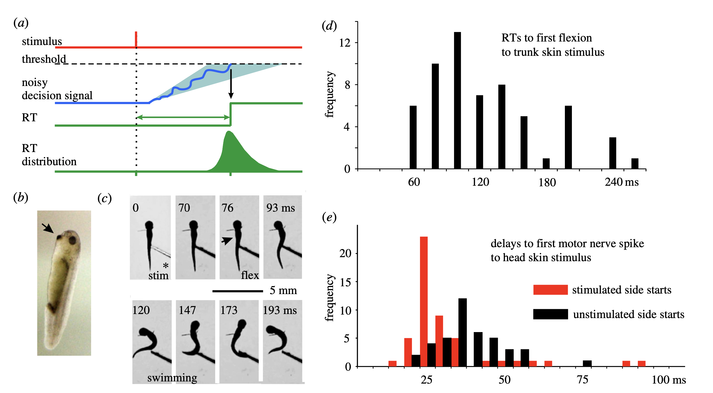
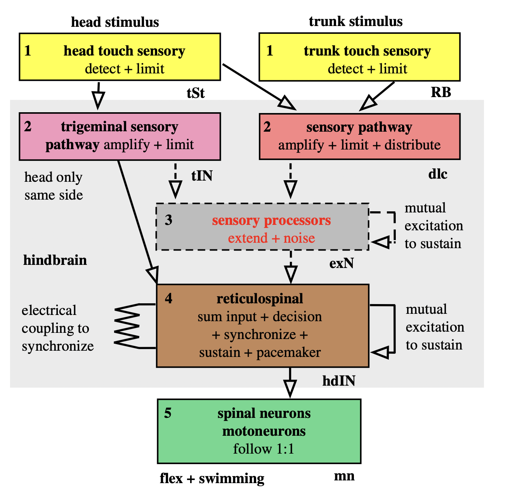
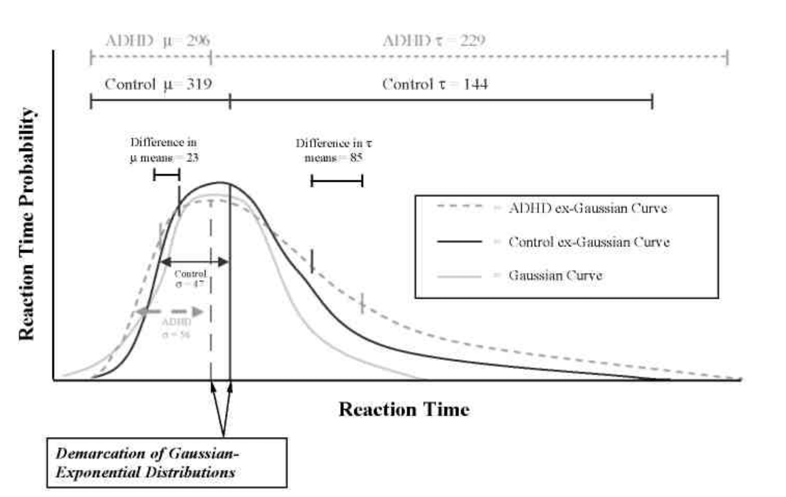
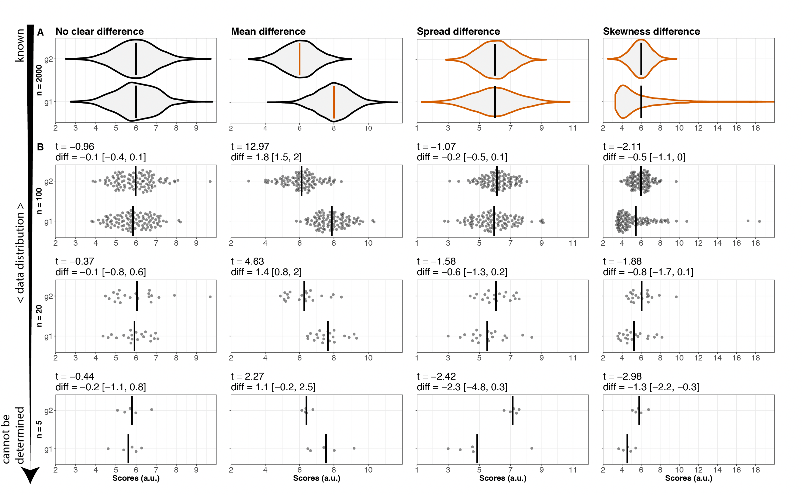
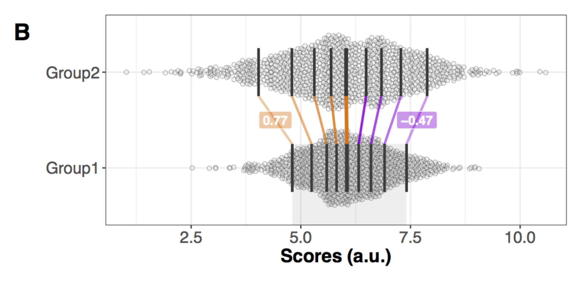
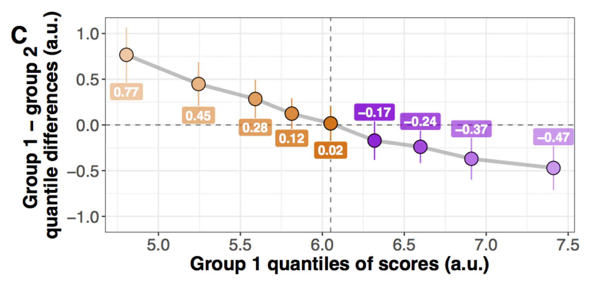
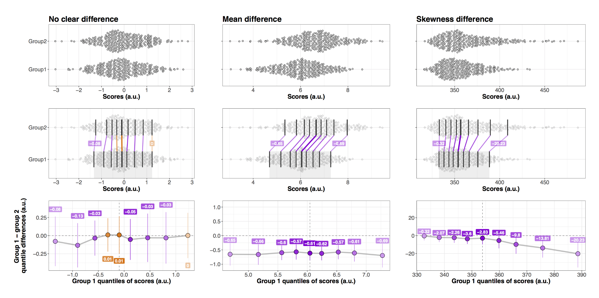

```{r child = "setup.Rmd"}
```

```{r load-packages, include=FALSE, warning=FALSE}
library(tidyverse)
library(rmarkdown)
library(countdown)
```


class: middle

.pull-left-narrow[
  .huge-blue-number[1]
]
.pull-right-wide[
  .larger[
    What are response times?
  ]
]

---

## What are Response Times?

.pull-left[

```{r echo = FALSE, out.width = "100%"}

```

]

.pull-right[

Typical distribution of response times.

- Time taken to complete a task.

- Typically, _some_ observed RTs are not a result of the _process of interest_,but _contaminants_. Luce (1986) demonstrated that genuine RTs have a minimum value of $> 100$ ms: the time needed for physiological processes (stimulus perception, motor responses).

]


Whelan, R. (2008). Effective Analysis of Reaction Time Data. The Psychological Record, 58(3), 475–482. https://doi.org/10.1007/BF03395630

---

.panelset[
.panel[.panel-name[Simulate data]

```{r}
set.seed(37)
d <- tibble(rt = brms::rexgaussian(n = 1e3, mu = 400, sigma = 50, beta = 150),
            contaminant = FALSE)
```
]

.panel[.panel-name[Code for figure]

```{r eval=FALSE, include=TRUE}
d |> 
  ggplot(aes(rt)) +
  geom_histogram(aes(y = ..density..), 
                 colour = "black", fill = "white",
                 binwidth = 10) +
  geom_density(lwd = 1, colour = 4,
               fill = 4, alpha = 0.25) +
  xlab("Response time [ms]") +
  xlim(c(0, 1500))
```
]

.panel[.panel-name[Figure]
```{r echo=FALSE}
d |> 
  ggplot(aes(rt)) +
  geom_histogram(aes(y = ..density..), 
                 colour = "black", fill = "white",
                 binwidth = 10) +
  geom_density(lwd = 1, colour = 4,
               fill = 4, alpha = 0.25) +
  xlab("Response time [ms]") +
  xlim(c(0, 1500))
```
]

.panel[.panel-name[Figure with contaminants]
```{r echo=FALSE}
contaminants <- tibble(rt = runif(100, 0, 1500), contaminant = TRUE)
d <- d |> bind_rows(contaminants)
d |> 
  ggplot(aes(rt)) +
  geom_histogram(aes(y = ..density..), 
                 colour = "black", fill = "white",
                 binwidth = 10) +
  geom_density(lwd = 1, colour = 4,
               fill = 4, alpha = 0.25) +
  geom_rug(aes(color = contaminant)) +
  scale_color_manual(values = c("black", "red")) +
  xlab("Response time [ms]") +
  xlim(c(0, 1500))
```
]
]


---


class: middle

.pull-left-narrow[
  .huge-blue-number[2]
]
.pull-right-wide[
  .larger[
    What can response times tell us about the brain?
  ]
]

---

## Tadpoles

.pull-left[

```{r echo = FALSE, out.width = "100%"}

```


]

.pull-right[

```{r echo = FALSE, out.width = "100%"}

```


]

Roberts, A., Borisyuk, R., Buhl, E., Ferrario, A., Koutsikou, S., Li, W.-C., & Soffe, S. R. (2019). The decision to move: Response times, neuronal circuits and sensory memory in a simple vertebrate. Proceedings of the Royal Society B: Biological Sciences, 286(1899), 20190297. https://doi.org/10.1098/rspb.2019.0297

---


## ADHD

.pull-left[

- Performance variability is the essence of ADHD.

- Children with ADHD demonstrate greater RT variability than nonclinical controls on speeded RT tasks.

> Response variability is related to a distributed brain network including frontal lobes (implicated in the pathophysiology of ADHD).

- Traditional RT measures (sample mean and standard deviation) showed that children with ADHD were slower and more variable in responding than controls.

]

.pull-right[

- Children with ADHD had a greater number of RTs beyond their mean performance than the control group. Were not generally slower but were prone to attentional lapses.


```{r echo = FALSE, out.width = "100%"}

```

]

Hervey, A. S., Epstein, J. N., Curry, J. F., Tonev, S., Eugene Arnold, L., Keith Conners, C., Hinshaw, S. P., Swanson, J. M., & Hechtman, L. (2006). Reaction Time Distribution Analysis of Neuropsychological Performance in an ADHD Sample. _Child Neuropsychology_, _12_(2), 125–140. [https://doi.org/10.1080/09297040500499081](https://doi.org/10.1080/09297040500499081)


---

class: middle

.pull-left-narrow[
  .huge-blue-number[3]
]
.pull-right-wide[
  .larger[
    How can we analyze response times?
  ]
]

---

## Central tendency: Mean

- Most common method of analyzing RT data is to report a central tendency parameter (e.g., the mean or median) and a dispersion parameter (e.g., the standard deviation). The mean difference in RT across conditions is then often analyzed by using ANOVA.

- Using hypothesis tests on data that are skewed, contain outliers, are heteroscedastic, or have a combination of these characteristics (raw RT data typically have at least the first two) reduces the power of these tests and can result in a failure to detect a real difference between conditions (Wilcox, 1998).

- Neither the mean nor standard deviation are said to be _robust_ measures. That is, the mean is not reflective of the typical response if the distribution is skewed, because the mean is distorted in the direction of the skew.

---

## Central tendency: Median

- Many researchers report the median RT as a central tendency parameter, because it is less susceptible to departures from normality (i.e., robust). The interquartile range (IQR, the range between the third and first quartiles) is a robust method of estimating the dispersion.

- A difficulty with using the median is that unlike the sample mean, it is a _biased_ estimator of the population median when the population is skewed (a biased estimator does not, on average, equal the value of the parameter or function that it estimates).

- The bias becomes more extreme as the sample size becomes smaller (Miller, 1988) and thus the median is more likely to be overestimated in the condition with fewer trials.


---

## Beyond mean differences

.pull-left[
- Most analyses of RT data are conducted by using the statistical techniques with which psychologists are most familiar, such as analysis of variance (ANOVA) on the sample mean. Unfortunately, these methods are usually inappropriate for RT data, because they have little power to detect genuine differences in RT between conditions.

]

.pull-right[


```{r echo = FALSE, out.width = "100%"}

```

]

Rousselet, G. A., Pernet, C. R., & Wilcox, R. R. (2017). Beyond differences in means: Robust graphical methods to compare two groups in neuroscience. _European Journal of Neuroscience_, _46_(2), 1738–1748. [https://doi.org/10.1111/ejn.13610](https://doi.org/10.1111/

---

## Beyond mean differences

.pull-left[
Deciles 

```{r echo = FALSE, out.width = "100%"}

```
]

.pull-right[

Shift function

```{r echo = FALSE, out.width = "100%"}

```
]

- For	each	decile, the	shift	 function	illustrates	by	how	much one	distribution needs	to	be	shifted	to	match	another	one. 

- In	our	example, we	illustrate by	how	much	we need	to	shift	deciles	from	group	2	to	match	deciles	from	group	1.

---

## Beyond mean differences

```{r echo = FALSE, out.width = "100%"}

```
