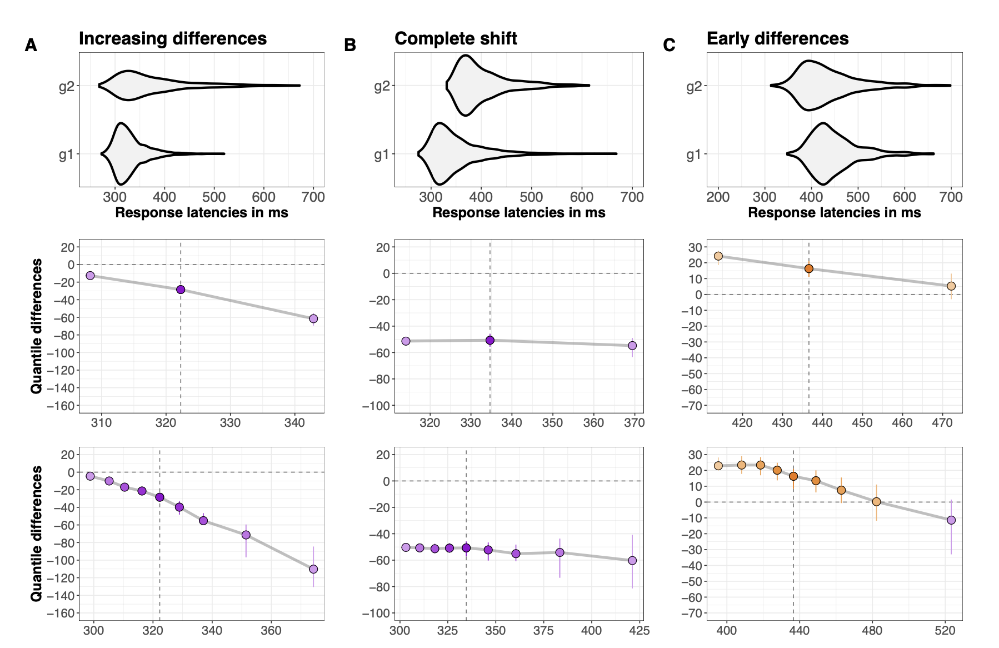

```{r child = "setup.Rmd"}
```

```{r load-packages, include=FALSE, warning=FALSE}
library(tidyverse)
library(rmarkdown)
library(countdown)
```

## Next sessions

- Evidence accumulation

- Bayesian data analysis

- Is the brain Bayesian?

---

class: middle

.pull-left-narrow[
  .huge-blue-number[1]
]
.pull-right-wide[
  .larger[
    What can we learn?
  ]
]

---

## ADHD: Response Time Variability

- Children with ADHD show cognitive impairments in attention, inhibitory control, and working memory compared with typically-developing children.

- No specific cognitive impairment is universal across patients with ADHD. One of the more consistent findings in the ADHD neuropsychology literature is increased reaction time variability (RTV), also known as intra-individual variability, on computerized tasks.

- Children with ADHD have also been shown to be less able to deactivate the DMN than controls, and this inability to deactivate the DMN has been directly related to RTV.

- Does RTV reflect a single construct or process? The vast majority of studies have used a reaction time standard deviation (RTSD).

---

## Facilitation

- Stroop task vs Simon task

- _Facilitation effects in both task.

- Stroop effects are smallest for fast responses and increase as responses slow. 

- Simon effects are largest for fast responses but decrease, and even reverse, as responses slow (see [DEMO](https://www.psytoolkit.org/experiment-library/simon.html)).


Pratte, M. S., Rouder, J. N., Morey, R. D., & Feng, C. (2010). Exploring the differences in distributional properties between Stroop and Simon effects using delta plots. Attention, Perception, & Psychophysics, 72(7), 2013–2025. https://doi.org/10.3758/APP.72.7.2013

---

## Experimental manipulations

.pull-left[

- affects most strongly slow behavioural responses, but with limited effects on fast responses.

- affects all responses, fast and slow, similarly.

- has stronger effects on fast responses, and weaker ones for slow responses.

]

.pull-right[

```{r echo = FALSE, out.width = "100%"}

```
]

Distribution analysis provides much stronger constraints on the underlying cognitive architecture than comparisons limited to e.g. mean or median reaction times across participants.

---


class: middle

.pull-left-narrow[
  .huge-blue-number[2]
]
.pull-right-wide[
  .larger[
    Shift Function
  ]
]

---

## Shift Function: Independent Groups

.panelset[
.panel[.panel-name[Uniform shift]

```{r echo=FALSE}
library(retimes)
library(rogme)
nt <- 1000
# ex Gaussian parameters
mu <- 500
sigma <- 50
tau <- 200
ES <- 50

set.seed(21)
g1 <- rexgauss(nt, mu = mu, sigma = sigma, tau = tau) 
g2 <- rexgauss(nt, mu = mu, sigma = sigma, tau = tau) + ES
df <- mkt2(g1, g2, group_labels = c("Condition1", "Condition2"))

p <- ggplot(df, aes(x = obs)) + theme_classic() + 
  stat_density(aes(colour = gr), geom="line",position="identity", size=1) +
  scale_colour_viridis_d(end = 0.8) +
  coord_cartesian(xlim = c(0, 2500)) +
  theme(axis.title.x = element_text(size = 18),
        axis.text.x = element_text(size = 16, colour="black"),
        axis.text.y = element_text(size = 16, colour="black"),
        axis.title.y = element_text(size = 18),
        legend.key.width = unit(1.5,"cm"),
        legend.position = c(0.55,0.75),
        legend.direction = "vertical",
        legend.text=element_text(size=16),
        legend.title=element_text(size=18),
        title = element_text(size=20)) +
  labs(x = "Reaction times", y = "Density", colour = "Conditions") +
  ggtitle("Uniform shift")
p
```
]


.panel[.panel-name[Shift function]
```{r}
out <- shifthd_pbci(df, nboot = 200, adj_ci = FALSE)
p <- plot_sf(out, plot_theme = 1)[[1]] + 
     theme(axis.text = element_text(size = 16, colour="black"))
```

]

.panel[.panel-name[Plot shift function]
```{r}
p
```

]
]

---


class: middle

.pull-left-narrow[
  .huge-blue-number[3]
]
.pull-right-wide[
  .larger[
    Hierarchical Shift Function
  ]
]

---

## Hierarchical Shift Function

1) quantiles are computed for the distribution of measurements from each condition and each participant.

2) the quantiles are subtracted in each participant.

3) a trimmed mean is computed across participants for each quantile.

4) Confidence intervals are computed using the percentile bootstrap.

---

## Hierarchical Shift Function

```{r echo=FALSE}
set.seed(747)

nt <- 100 # trials
np <- 30 # participants
# ex Gaussian parameters
mu <- 500
sigma <- 50
tau <- 200
ES <- 50

# generate data: matrix participants x trials
data1 <- matrix(rexgauss(nt*np, mu = mu, sigma = sigma, tau = tau), nrow = np)
data2 <- matrix(rexgauss(nt*np, mu = mu, sigma = sigma, tau = tau), nrow = np) + ES

# analysis parameters
qseq <- seq(0.1,0.9,0.1) # quantiles
alpha <- 0.05
nboot <- 1000 # bootstrap
tr <- 0.2 # group trimmed mean for each quantile
nq <- length(qseq)
df <- tibble(rt = c(as.vector(data1), as.vector(data2)),
             cond = factor(c(rep("cond1", nt*np),rep("cond2", nt*np))),
             id = factor(rep(seq(1,np),nt*2)))
```

.panelset[
.panel[.panel-name[Shift function]
```{r}

out <- hsf(df, rt ~ cond + id)
```

]

.panel[.panel-name[Plot shift function]
```{r}
p <- plot_hsf(out)
p
```

]
.panel[.panel-name[Stochastic dominance]

### Participants with all quantile differences > 0

```{r}
nq <- length(out$quantiles)
pdmt0 <- apply(out$individual_sf > 0, 2, sum)
print(paste0('In ',sum(pdmt0 == nq),' participants (',round(100 * sum(pdmt0 == nq) / np, digits = 1),'%), all quantile differences are more than to zero'))
```

### Participants with all quantile differences < 0

```{r}
pdlt0 <- apply(out$individual_sf < 0, 2, sum)
print(paste0('In ',sum(pdlt0 == nq),' participants (',round(100 * sum(pdlt0 == nq) / np, digits = 1),'%), all quantile differences are less than to zero'))
```

]
]


---

## Hierarchical Shift Function

Alternative bootstrapping method: `hsf_pb()`


```{r}
set.seed(8899)
out <- rogme::hsf_pb(df, rt ~ cond + id)
```

```{r}
rogme::plot_hsf_pb(out, interv = "ci")
```

---

class: middle

.pull-left-narrow[
  .huge-blue-number[4]
]
.pull-right-wide[
  .larger[
    Bootstrapping
  ]
]

---

## Bootstrapping

> "The bootstrap is a computer-based method for assigning measures of accuracy to statistical estimates." Efron & Tibshirani, An introduction to the bootstrap, 1993

> "The central idea is that it may sometimes be better to draw conclusions about the characteristics of a population strictly from the sample at hand, rather than by making perhaps unrealistic assumptions about the population." Mooney & Duval, Bootstrapping, 1993


- Like all bootstrap methods, the percentile bootstrap relies on a simple & intuitive idea: instead of making assumptions about the underlying distributions from which our observations could have been sampled, we use the data themselves to estimate sampling distributions. 

- In turn, we can use these estimated sampling distributions to compute confidence intervals, estimate standard errors, estimate bias, and test hypotheses (Efron & Tibshirani, 1993; Mooney & Duval, 1993; Wilcox, 2012). 

- The core principle to estimate sampling distributions is resampling. The technique was developed & popularised by Brad Efron as the bootstrap.

---

## Bootstrapping


```{r}
heights <- c(183, 192, 182, 183, 177, 185, 188, 188, 182, 185)
```

```{r}
v1 <- sample(heights, replace = TRUE)
v1
```

```{r}
v2 <- sample(heights, replace = TRUE)
v2
```


Essentially, we are doing fake experiments using only the observations from our sample. And for each of these fake experiments, or bootstrap sample, we can compute any estimate of interest, for instance the median.

For a visualization, see this [demo](https://seeing-theory.brown.edu/frequentist-inference/index.html#section2).
---

## Bootstrapping

.panelset[
.panel[.panel-name[Function to resample and compute mean]

```{r}
f <- function(v) {
  vv <- sample(v, replace = TRUE)
  mean(vv)
}
```

]
.panel[.panel-name[Repeat N times]

```{r}
N <- 4000
```

```{r}
b1 <- replicate(n = N, f(heights))
```

```{r}
library(purrr)
b2 <- map_dbl(1:N, ~f(heights))
```

```{r}
d <- tibble(b1 = b1, b2 = b2) |> 
  pivot_longer(everything(), names_to = "bootstrap", values_to = "mean")
```

]
.panel[.panel-name[Visualize]

```{r}
d |> 
  ggplot(aes(mean, fill = bootstrap)) + 
  geom_histogram() +
  facet_wrap(~bootstrap)
```
]
]

---

## Bootstrapping

Bootstrapped standard error of the mean:

.panelset[
.panel[.panel-name[Method 1]

```{r}
d |> 
  group_by(bootstrap) |> 
  tidybayes::mean_qi()
```
]

.panel[.panel-name[Method 2]

```{r}
d |> 
  group_by(bootstrap) |> 
  summarize(estimate = mean(mean), 
            lower = quantile(mean, probs = 0.025),
            upper = quantile(mean, probs = 0.975))
```
]
]

