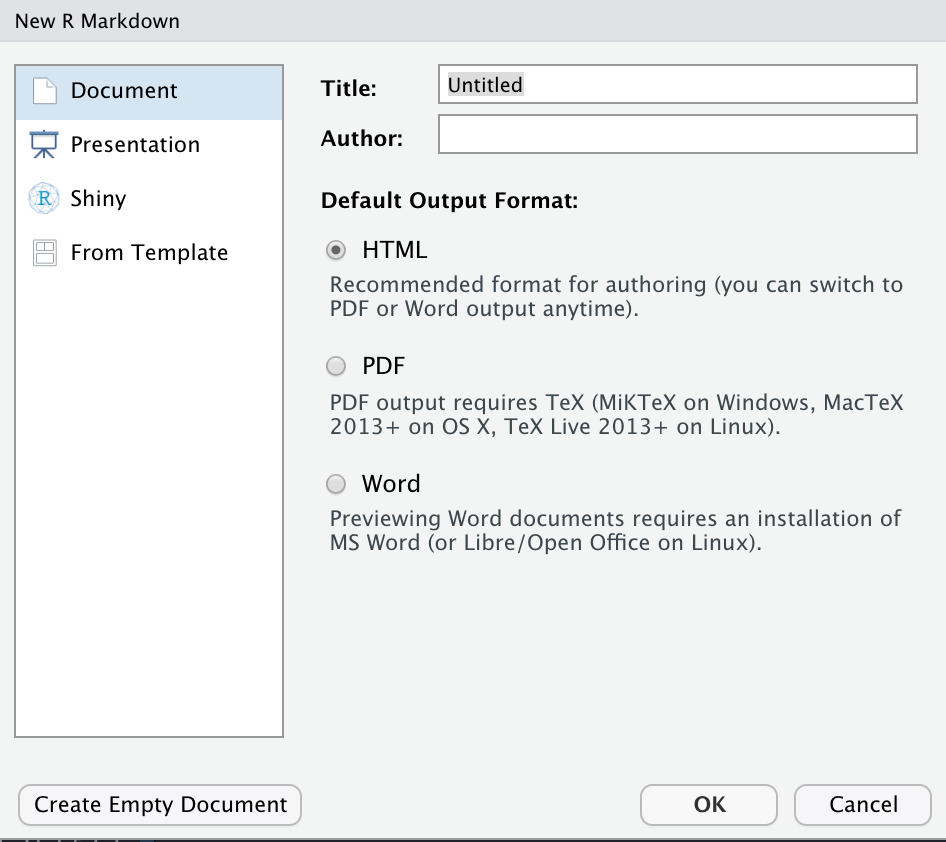

```{r setup, include=FALSE}
knitr::opts_chunk$set(echo = FALSE)
```


## `r fontawesome::fa(name = "r-project", fill = "steelblue")` RStudio Projekte
Ich empfehle (wie schon in den Statistik Übungen) **immer** in einem RStudio Projekt zu arbeiten. Als Faustregel: jedes Datenanalyseprojekt kriegt ein eigenes RStudio Projekt. Die Vorteile sind:
 
- Man kann das Projekt schliessen und wieder im gleichen Zustand öffnen, d.h. alle offenen Files werden wieder hergestellt. So kann man z.B. eine Woche lang nicht an einem Projekt arbeiten, und danach wieder in dem Zustand weiterfahren, in dem man aufgehört hat.
- Man muss keine absoluten Pfade benutzen, sondern nur relative.


## Rmarkdown
<!-- `r fontawesome::fa(name = "book", fill = "steelblue")` -->
Rmarkdown ist eine Erweiterung der Markdown Sprache, welche wiederum eine
einfache Sprache ist,  um Text zu formattieren. 


> Mit Markdown ist es möglich, HTML oder LaTeX zu erstellen, ohne das man selber viel HTML/LaTeX kennen muss. LaTeX ist vor allem dann gut, wenn man viele Formeln benutzt, oder komplizierte Dokumente erstellt.


Rmarkdown erlaubt zusätzlich die Einbindung von R Code; dieser wird zuerst evaluiert, und der Ouput wird zu Markdown konvertiert. Damit lassen sich Paper und Bachelor/Masterarbeiten schreiben, was sehr sinnvoll ist, wenn man mit R arbeitet.

Ein weiterer Grund, Rmarkdown zu benutzen, ist Reproduzierbarkeit. Man kann Code für Datenanalyse direkt in ein Manuskript einbinden, so dass die Resultate immer up-to-date sind, und nicht zwischen Dokumenten hin-und her kopiert werden müssen (was sehr fehleranfällig ist).

Ein exzellente Einführung in Rmarkdown finden Sie im Blog von Danielle Navarro:
[Einführung in Rmarkdown](https://slides.djnavarro.net/starting-rmarkdown/).


:::fyi
Schauen Sie sich die Slides an.
:::


 <aside>    
 Dieses Skript wird mit Rmarkdown erstellt. Wenn Sie auf das  Icon oben rechts klicken, sehen Sie den Source Code.</aside>


RStudio macht es sehr einfach, mit Rmarkdown zu arbeiten. Un ein neues Dokument zu erstellen, öffnen Sie das `File` Menu. Dort wählen Sie `New File` aus, und dann `Rmarkdown...`. 

Sie sehen dann dieses Dialogfenster:

```{r echo=FALSE, message=FALSE, warning=FALSE}

```

Hier können Sie das Output Format bestimmen: HTML, PDF (LaTeX), oder Word.

Nachdem Sie `OK` geklickt haben, erhalten Sie ein Rmarkdown Template. Dies können Sie mit der `Knit` Funktion zu einem HTML (oder PDF, Word) konvertieren. Zuerst müssen Sie das Dokument jedoch speichern.


:::exercise
Erstellen Sie ein Rmarkdown Dokument und speichern Sie es. Probieren Sie
verschiedene Output Formate, und `knitten` Sie das Dokument.
:::

In der nächsten Übung machen wir zwei ganz wichtige Dinge: wir benutzen Rmarkdown, und wir generieren Daten. Genauer gesagt benutzen wir ein statistisches (probabilistisches) Modell, um Zufallszahlen zu generieren. In dieser Übung generieren wir Daten, die dem statistischen Modell eines t-Tests entsprechen.


:::exercise
Fügen Sie folgenden R Code in einen oder (noch besser) mehreren Code Chunks ein. Benützen Sie Markdown Text, um das Ganze zu kommentieren., d.h. die Kommentare zwischen den R Code Zeilen könnten auch als Prosa zwischen R Code Chunks stehen.
:::


```{r echo=TRUE}
library(tidyverse)

set.seed(12)

# Number of people wearing fancy hats
N_fancyhats <- 50 

# Number of people not wearing fancy hats
N_nofancyhats <- 50

# Population mean of creativity for people wearing fancy hats
mu_fancyhats <- 103 

# Population mean of creativity for people wearing no fancy hats
mu_nofancyhats <- 98 

# Average population standard deviation of both groups
sigma <- 15 

# Generate data
fancyhats = tibble(Creativity = rnorm(N_fancyhats, mu_fancyhats, sigma),
               Group = "Fancy Hat")

nofancyhats = tibble(Creativity = rnorm(N_nofancyhats, mu_nofancyhats, sigma),
                 Group = "No Fancy Hat")


FancyHat <- bind_rows(fancyhats, nofancyhats)  %>%
    mutate(Group = fct_relevel(as.factor(Group), "No Fancy Hat"))


# plot both groups
FancyHat %>% 
    ggplot() +
    geom_boxplot ((aes(y = Creativity, x = Group))) +
    labs(title= "Box Plot of Creativity Values") +
    theme_bw()
```

Mit diesem Code simulieren Sie zwei experimentelle Gruppen, mit je 50 Teilnehmern. Die eine Gruppe trug "fancy hats", die andere Gruppe nicht. Wir generieren normalverteilte Zufallszahlen---für die `Fancy Hat` Gruppe mit $\mu=103$, für die `No Fancy Hat` mit $\mu=98$. Mit `bind_rows()` fügen wir beide Dataframes zusammen, und am Schluss machen wir einen Boxplot.


Wenn Sie eine R Code Chunk einfügen, z.B. mit `Code` > `Insert Chunk`, erhalten Sie ein `Options` Icon am oberen rechten Rand des Chunks. Hier können Sie wählen, ob der Code/Output angezeigt wird.


:::exercise
Führen Sie einen (gerichteten) t-Test in einem Code Chunk durch. Zur Erinnerung: Sie brauchen die Funktion `t.test()` mit den Argumenten  `alternative = "less"` und `var.equal = TRUE`.
:::

#### Lösung {-}
```{r}
t.test(Creativity ~ Group,
       alternative = "less",
       var.equal = TRUE,
       data = FancyHat)
```


#### Übung {-}
Das gleiche Modell können Sie (für den ungerichteten Fall) auch als Allgemeines Lineares Modell formulieren.

```{block, type = "uebung"}
Versuche Sie es! Sie benötigen die Funktion `lm()`.
```

#### Lösung {-}
```{r}
model <- lm(Creativity ~ Group,
            data = FancyHat)
summary(model)
```


```{block, type = "uebung"}
Berechen Sie den Mittelwertsunterschied selber, z.B. mit Hilfe von `group_by()`, `summarize()`, `pivot_wider()` ud `mutate()`.
```

#### Lösung {-}

```{r}
library(tidyverse)
Means <- FancyHat %>% 
    group_by(Group) %>% 
    summarise(Creativity = mean(Creativity)) 
```

```{r}
Means_wide <- Means %>% 
    pivot_wider(names_from = Group, values_from = Creativity)
```

```{r}
Means_wide %>% 
    mutate(diff = `No Fancy Hat` - `Fancy Hat`)
```
