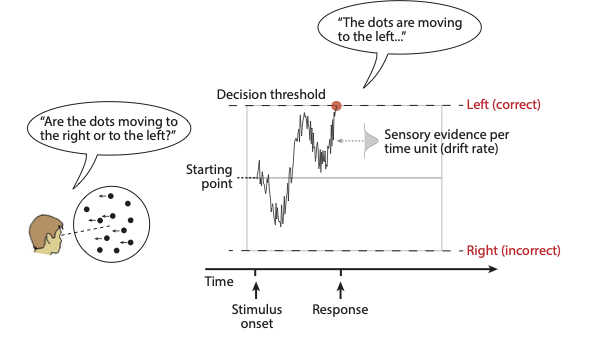

```{r child = "setup.Rmd"}
```

```{r load-packages, include=FALSE, warning=FALSE}
library(tidyverse)
library(rmarkdown)
library(countdown)
```


## (Model-based) Cognitive Neuroscience
.discussion[

1) Was heisst Model-based Neuroscience?

2) Welche Kenntnisse brauchen wir, um Experiment durchzuführen und Daten auszuwerten?

3) Welche Programmiertechniken/sprachen brauchen wir?

]

---

## Model-based Neuroscience: Beispiel

Wir lesen ein Beispielpaper:

Mulder, M. J., Wagenmakers, E.-J., Ratcliff, R., Boekel, W., & Forstmann, B. U. (2012). Bias in the Brain: A Diffusion Model Analysis of Prior Probability and Potential Payoff. Journal of Neuroscience, 32(7), 2335–2343.

👉 [https://www.jneurosci.org/content/32/7/2335](https://www.jneurosci.org/content/32/7/2335)

In dieser Studie geht es darum, den Einfluss von Vorwissen (prior knowledge) auf eine simple perzeptuelle Entscheidung zu untersuchen. 

- Als Task haben die Autoren ein Random Dot Motion Experiment benutzt. 
- Für die Datenanalyse wurde unter anderem ein Diffusion Decision Model verwendet.


---

## Diffusion Decision Model
```{r echo=FALSE, fig.height=5, fig.width=7}

```

---

## Model-based Neuroscience

.your-turn[

Überfliegen Sie das Paper, und achten Sie dabei darauf, welche Skills Sie benötigen, um eine solche Studie durchzuführen.

1) Welches theoretische Wissen brauchen Sie?

2) Welche Programmierkenntnisse brauchen Sie?
  - für das Experiment
  - für die Datenanalyse

3) Welche statistischen Verfahen brauchen Sie, um die Daten auszuwerten?

4) Warum wurde das Experiment im Scanner und ausserhalb des Scanners durchgeführt?

5) Was kann man mit einer solchen Studie herausfinden?
]

```{r echo=FALSE}
countdown(minutes = 15)
```

---

## Vorwissen

Es wurden zwei verschieden Typen von Vorwissen benutzt. 

1) A-Priori Wahrscheinlichkeit, dass die Punktwolke sich nach rechts oder nach links bewegte.

2) Asymmetrische Belohnung für  korrekte links/rechts Entscheidungen. 

--

```{r echo=FALSE, fig.height=5, fig.width=7}
knitr::include_graphics("images/bias-payoff-mulder.png")
```
---

## Diffusion Decision Model
```{r echo=FALSE, fig.height=5, fig.width=7}

```

---


## Model-based Neuroscience

.pull-left[
Schematische Darstellung der erwarteten Resultate.

- Starting point: korrekte und inkorrekte RTs unterschieden sich.
  
- Drift rate: korrekte und inkorrekte RTs sind sich ähnlich.

```{r echo=FALSE, fig.height=2.5, fig.width=3.5}
knitr::include_graphics("images/expected-results-mulder.png")
```
]

.pull-right[

Tatsächliche Resultate: Quantifizierung des Bias anhand des DDM.


```{r echo=FALSE, fig.height=2.5, fig.width=3.5}
knitr::include_graphics("images/mulder-behav-results.png")
```
]


---

## Model-based Neuroscience

BOLD Responses der Areale welche besonder stark auf die "prior probability" (oben) und auf die "payoff" Manipulation (unten) reagierten.

.pull-left[
- right MedFG (right medial frontal gyrus)
- ACG (anterior cingulate cortex)
- SFG (superior frontal gyrus)
- left middle temporal gyrus
- IPS (intra-parietal sulcus). 
]

.pull-right[
```{r echo=FALSE, fig.height=5, fig.width=7}
knitr::include_graphics("images/BOLD-starting-point.png")
```
]

Diese Areale sollen eine besondere Rolle in der Verarbeitung von Bias im Entscheidungsverhalten haben.

---

## Wichtige Skills

.pull-left[
- Theorien über Entscheidungsverhalten

- Experimente programmieren
    - Timing (inside/outside scanner)

- Data cleaning and manipulation (data wrangling)

- Statistische Verfahren für messwiederholte Daten
    - Psychometric curve
    - Binary choices / Reaktionszeiten
    - repeated-measures ANOVA

]

--
.pull-right[

- Grafische Darstellung der Resultate

- Kognitive Prozessmodelle
    - fit Diffusion Decision Model (DDM)

- Auswertung von fRMI Daten


]

Mit diesen Themen (ausser der Analyse von fMRI Daten) beschäftigen wir uns in diesem Kurs. 

