```r
library(tidyverse)
data <- read_csv("data/rdkdata.csv")
```

```
## Rows: 1440 Columns: 9
## ── Column specification ────────────────────────────────────────
## Delimiter: ","
## chr (5): ID, cue, direction, choice, condition
## dbl (4): trial, response, rt, correct
## 
## ℹ Use `spec()` to retrieve the full column specification for this data.
## ℹ Specify the column types or set `show_col_types = FALSE` to quiet this message.
```
Ob eine Variable als `factor` definiert ist, wird als Attribut gespeichert. Attribute werden aber in einem `.csv.` File nicht mitgespeichert; deshalb müssen wir die Gruppierungsvariablen wieder als `factor` definieren. 


```r
data <- data |>
    mutate_if(is.character, as.factor)
```


```r
glimpse(data)
```

```
## Rows: 1,440
## Columns: 9
## $ trial     <dbl> 0, 1, 2, 3, 4, 5, 6, 7, 8, 9, 10, 11, 12, 13…
## $ ID        <fct> JH, JH, JH, JH, JH, JH, JH, JH, JH, JH, JH, …
## $ cue       <fct> right, right, none, none, left, none, none, …
## $ direction <fct> right, right, right, right, left, right, lef…
## $ response  <dbl> 1, 1, 0, 1, 1, 1, 1, 0, 0, 1, 0, 0, 0, 0, 1,…
## $ rt        <dbl> 0.7136441, 0.6271285, 0.6703410, 0.5738488, …
## $ choice    <fct> right, right, left, right, right, right, rig…
## $ correct   <dbl> 1, 1, 0, 1, 0, 1, 0, 1, 0, 1, 1, 1, 1, 1, 1,…
## $ condition <fct> valid, valid, neutral, neutral, valid, neutr…
```


# Binary Choices

## Pro Versuchsperson


```r
data
```

```
## # A tibble: 1,440 × 9
##    trial ID    cue   direction response    rt choice correct
##    <dbl> <fct> <fct> <fct>        <dbl> <dbl> <fct>    <dbl>
##  1     0 JH    right right            1 0.714 right        1
##  2     1 JH    right right            1 0.627 right        1
##  3     2 JH    none  right            0 0.670 left         0
##  4     3 JH    none  right            1 0.574 right        1
##  5     4 JH    left  left             1 0.841 right        0
##  6     5 JH    none  right            1 0.668 right        1
##  7     6 JH    none  left             1 1.12  right        0
##  8     7 JH    left  left             0 0.640 left         1
##  9     8 JH    left  right            0 1.13  left         0
## 10     9 JH    none  right            1 1.03  right        1
## # … with 1,430 more rows, and 1 more variable: condition <fct>
```


```r
data |> 
  group_by(ID, condition)
```

```
## # A tibble: 1,440 × 9
## # Groups:   ID, condition [27]
##    trial ID    cue   direction response    rt choice correct
##    <dbl> <fct> <fct> <fct>        <dbl> <dbl> <fct>    <dbl>
##  1     0 JH    right right            1 0.714 right        1
##  2     1 JH    right right            1 0.627 right        1
##  3     2 JH    none  right            0 0.670 left         0
##  4     3 JH    none  right            1 0.574 right        1
##  5     4 JH    left  left             1 0.841 right        0
##  6     5 JH    none  right            1 0.668 right        1
##  7     6 JH    none  left             1 1.12  right        0
##  8     7 JH    left  left             0 0.640 left         1
##  9     8 JH    left  right            0 1.13  left         0
## 10     9 JH    none  right            1 1.03  right        1
## # … with 1,430 more rows, and 1 more variable: condition <fct>
```


```r
accuracy <- data |>
    group_by(ID, condition) |>
    summarise(N = n(),
              ncorrect = sum(correct),
              accuracy = mean(correct))
```

```
## `summarise()` has grouped output by 'ID'. You can override
## using the `.groups` argument.
```


```r
accuracy
```

```
## # A tibble: 27 × 5
## # Groups:   ID [9]
##    ID    condition     N ncorrect accuracy
##    <fct> <fct>     <int>    <dbl>    <dbl>
##  1 JH    invalid      16       13   0.812 
##  2 JH    neutral      80       66   0.825 
##  3 JH    valid        64       60   0.938 
##  4 NS    invalid      16       11   0.688 
##  5 NS    neutral      80       56   0.7   
##  6 NS    valid        64       58   0.906 
##  7 rh    invalid      16        2   0.125 
##  8 rh    neutral      80       64   0.8   
##  9 rh    valid        64       61   0.953 
## 10 sb    invalid      16        1   0.0625
## # … with 17 more rows
```

## Visualisieren


```r
accuracy |> 
  ggplot(aes(x = condition, y = accuracy, fill = condition)) +
  geom_col() +
  geom_line(aes(group = ID), size = 2) +
  geom_point(size = 8) +
  scale_fill_manual(
    values = c(invalid = "#9E0142",
    neutral = "#C4C4B7",
    valid = "#2EC762")
  ) +
  labs(
    x = "Cue",
    y = "Proportion correct",
    title = "Accuracy per person/condition"
  ) +
  theme_linedraw(base_size = 28) +
  facet_wrap(~ID)
```

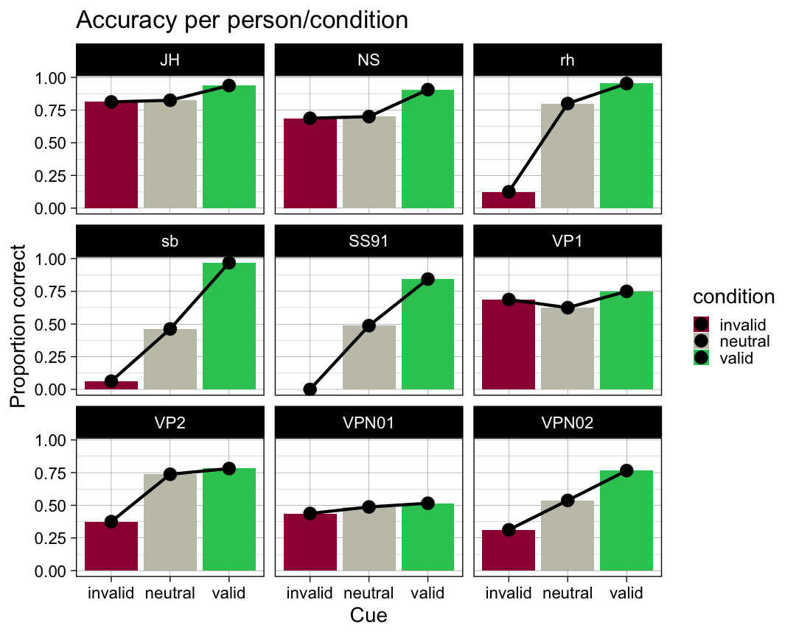

## Über Versuchsperson aggregieren

## Ein Exkurs über Within-person Standardfehler 


```r
library(tidyverse)

dfw <- tribble(
 ~subject, ~pretest, ~posttest,
       1,   59.4,     64.5,
       2,   46.4,     52.4,
       3,   46.0,     49.7,
       4,   49.0,     48.7,
       5,   32.5,     37.4,
       6,   45.2,     49.5,
       7,   60.3,     59.9,
       8,   54.3,     54.1,
       9,   45.4,     49.6,
      10,   38.9,     48.5) |>
    mutate(subject = as.factor(subject))


dfl <- dfw |>
    pivot_longer(contains("test"),
                 names_to = "condition",
                 values_to = "value") |>
    mutate(condition = as_factor(condition))

dflsum <- dfl |>
    Rmisc::summarySEwithin(measurevar = "value",
                               withinvars = "condition",
                               idvar = "subject",
                               na.rm = FALSE,
                               conf.interval = 0.95)

dflsum |>
    ggplot(aes(x = condition, y = value, group = 1)) +
    geom_line() +
    geom_errorbar(width = 0.1, aes(ymin = value-ci, ymax = value+ci)) +
    geom_point(shape = 21, size = 3, fill = "white") +
    ylim(40,60)
```

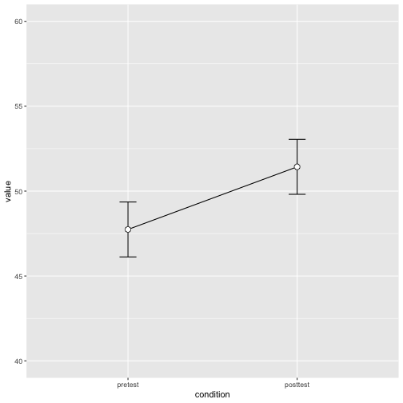

```r
# Use a consistent y range
ymax <- max(dfl$value)
ymin <- min(dfl$value)

# Plot the individuals
dfl |>
    ggplot(aes(x=condition, y=value, colour=subject, group=subject)) +
    geom_line() + geom_point(shape=21, fill="white") +
    ylim(ymin,ymax)
```

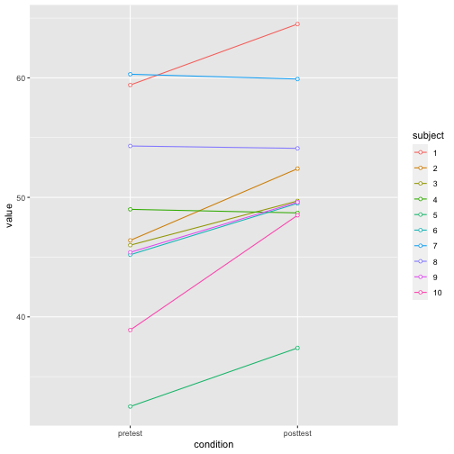

```r
dfNorm_long <- Rmisc::normDataWithin(data=dfl, idvar="subject", measurevar="value")
?Rmisc::normDataWithin

dfNorm_long |>
    ggplot(aes(x=condition, y=valueNormed, colour=subject, group=subject)) +
    geom_line() + geom_point(shape=21, fill="white") +
    ylim(ymin,ymax)
```

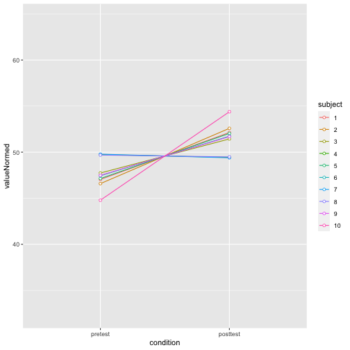

```r
# Instead of summarySEwithin, use summarySE, which treats condition as though it were a between-subjects variable
dflsum_between <- Rmisc::summarySE(data = dfl, 
                                   measurevar = "value", 
                                   groupvars = "condition", 
                                   na.rm = FALSE, 
                                   conf.interval = .95)
dflsum_between
```

```
##   condition  N value       sd       se       ci
## 1   pretest 10 47.74 8.598992 2.719240 6.151348
## 2  posttest 10 51.43 7.253972 2.293907 5.189179
```

```r
# Show the between-S CI's in red, and the within-S CI's in black
dflsum_between |>
    ggplot(aes(x=condition, y=value, group=1)) +
    geom_line() +
    geom_errorbar(width=.1, aes(ymin=value-ci, ymax=value+ci), colour="red") +
    geom_errorbar(width=.1, aes(ymin=value-ci, ymax=value+ci), data=dflsum) +
    geom_point(shape=21, size=3, fill="white") +
    ylim(ymin,ymax)
```

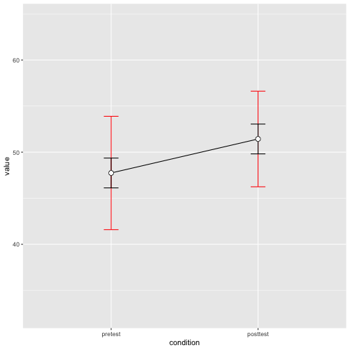


## Within-person Staandardfehler


```r
accuracy |> 
  ggplot(aes(x = condition, y = accuracy, colour = ID, group = ID)) +
    geom_line() + 
  geom_point(shape=21, fill="white")
```

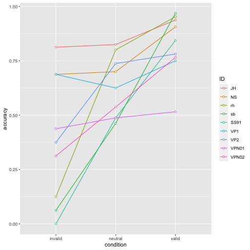


```r
se <- function(x) sd(x)/sqrt(length(x))

datasum <- data |>
   group_by(condition) |> 
   summarise(N = n(),
             ccuracy = mean(correct),
             sd = sd(correct),
             se = se(correct))
datasum
```

```
## # A tibble: 3 × 5
##   condition     N ccuracy    sd     se
##   <fct>     <int>   <dbl> <dbl>  <dbl>
## 1 invalid     144   0.389 0.489 0.0408
## 2 neutral     720   0.629 0.483 0.0180
## 3 valid       576   0.825 0.381 0.0159
```


```r
datasum_2 <- data |>
    Rmisc::summarySE(measurevar = "correct",
                              groupvars = "condition",
                               na.rm = FALSE,
                               conf.interval = 0.95)
datasum_2
```

```
##   condition   N   correct        sd         se         ci
## 1   invalid 144 0.3888889 0.4891996 0.04076663 0.08058308
## 2   neutral 720 0.6291667 0.4833637 0.01801390 0.03536613
## 3     valid 576 0.8246528 0.3805943 0.01585810 0.03114686
```


```r
datasum_3 <- data |>
    Rmisc::summarySEwithin(measurevar = "correct",
                               withinvars = "condition",
                               idvar = "ID",
                               na.rm = FALSE,
                               conf.interval = 0.95)
datasum_3
```

```
##   condition   N   correct        sd         se         ci
## 1   invalid 144 0.3888889 0.5773528 0.04811273 0.09510406
## 2   neutral 720 0.6291667 0.5726512 0.02134145 0.04189901
## 3     valid 576 0.8246528 0.4523391 0.01884746 0.03701827
```


```r
p_accuracy <- datasum_3 |>
    ggplot(aes(x = condition, y = correct, group = 1)) +
    geom_line() +
    geom_errorbar(width = .1, aes(ymin = correct-se, ymax = correct+se), colour="red") +
    geom_point(shape=21, size=3, fill="white")
p_accuracy
```

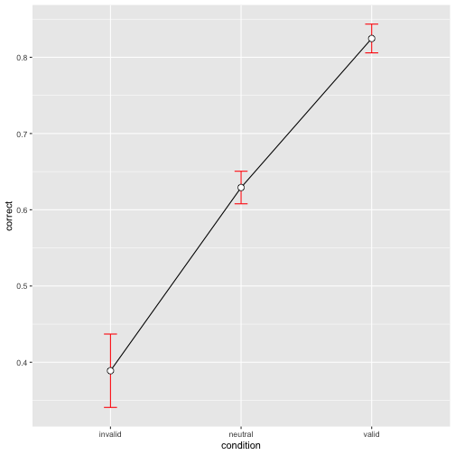


# Reaktionszeiten

## Pro Versuchsperson

Wir fassen die Daten pro Person pro Block mit Mittelwert, Median und Standarabweichung zusammen.


```r
funs <- list(mean = mean, median = median, sd = sd)

by_subj <- data %>%
  drop_na(rt) |> 
  group_by(ID, condition) %>% 
  dplyr::summarise(across(rt, funs, .names = "{.fn}"))
```

```
## `summarise()` has grouped output by 'ID'. You can override
## using the `.groups` argument.
```


```r
by_subj 
```

```
## # A tibble: 27 × 5
## # Groups:   ID [9]
##    ID    condition  mean median     sd
##    <fct> <fct>     <dbl>  <dbl>  <dbl>
##  1 JH    invalid   0.775  0.739 0.163 
##  2 JH    neutral   0.799  0.733 0.202 
##  3 JH    valid     0.696  0.658 0.190 
##  4 NS    invalid   0.894  0.913 0.207 
##  5 NS    neutral   0.885  0.844 0.201 
##  6 NS    valid     0.738  0.715 0.191 
##  7 rh    invalid   0.423  0.389 0.151 
##  8 rh    neutral   0.525  0.503 0.0841
##  9 rh    valid     0.443  0.390 0.185 
## 10 sb    invalid   0.376  0.341 0.0924
## # … with 17 more rows
```


Einfachere Version:


```r
data |> 
  drop_na(rt) |> 
  group_by(ID, condition) |>  
  dplyr::summarise(mean = mean(rt),
                   median = median(rt),
                   sd = sd(rt))
```

```
## `summarise()` has grouped output by 'ID'. You can override
## using the `.groups` argument.
```

```
## # A tibble: 27 × 5
## # Groups:   ID [9]
##    ID    condition  mean median     sd
##    <fct> <fct>     <dbl>  <dbl>  <dbl>
##  1 JH    invalid   0.775  0.739 0.163 
##  2 JH    neutral   0.799  0.733 0.202 
##  3 JH    valid     0.696  0.658 0.190 
##  4 NS    invalid   0.894  0.913 0.207 
##  5 NS    neutral   0.885  0.844 0.201 
##  6 NS    valid     0.738  0.715 0.191 
##  7 rh    invalid   0.423  0.389 0.151 
##  8 rh    neutral   0.525  0.503 0.0841
##  9 rh    valid     0.443  0.390 0.185 
## 10 sb    invalid   0.376  0.341 0.0924
## # … with 17 more rows
```


```r
by_subj |> 
  ggplot(aes(x = condition, y = mean, fill = condition)) +
  geom_col() +
  geom_line(aes(group = ID), size = 2) +
  geom_point(size = 8) +
  scale_fill_manual(
    values = c(invalid = "#9E0142",
    neutral = "#C4C4B7",
    valid = "#2EC762")
  ) +
  labs(
    x = "Cue",
    y = "Response time") +
  theme_linedraw(base_size = 28) +
  facet_wrap(~ID)
```

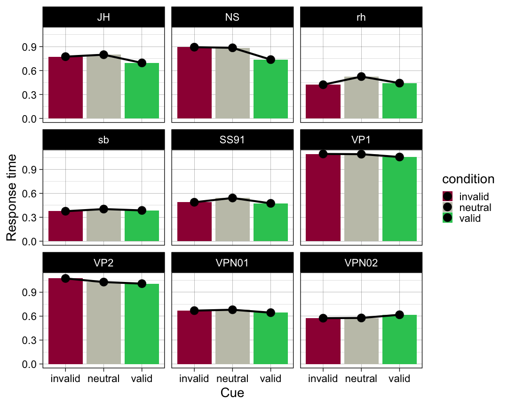


```r
se <- function(x, ...) sd(x, ...)/sqrt(length(x))

by_subj <- data %>% 
  group_by(ID, condition) %>% 
  summarise(mean = mean(rt, na.rm = TRUE), 
            median = median(rt, na.rm = TRUE), 
            sd = sd(rt, na.rm = TRUE), 
            se = se(rt, na.rm = TRUE))
```

```
## `summarise()` has grouped output by 'ID'. You can override
## using the `.groups` argument.
```


```r
by_subj |> 
  ggplot(aes(condition, mean)) +
  geom_line(aes(group = 1), linetype = 3) +    
  geom_errorbar(aes(ymin = mean-se, ymax = mean+se),
                width = 0.2, size=1, color="blue") +
  geom_point(size = 2) +
  facet_wrap(~ID, scales = "free_y")
```

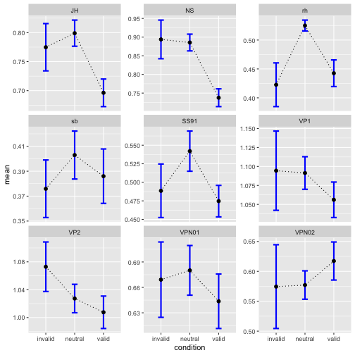


```r
by_subj |> 
  ggplot(aes(condition, mean)) +
  geom_line(aes(group = 1), linetype = 3) +    
  geom_errorbar(aes(ymin = mean-se, ymax = mean+se),
                width = 0.2, size=1, color="blue") +
  geom_point(size = 2) +
  geom_point(aes(condition, median), size = 2, color = "red") +
  facet_wrap(~ID, scales = "free_y")
```

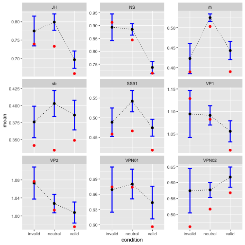

## Über Versuchsperson aggregieren


```r
rtsum <- data |>
  drop_na(rt) |> 
    Rmisc::summarySEwithin(measurevar = "rt",
                               withinvars = "condition",
                               idvar = "ID",
                               na.rm = FALSE,
                               conf.interval = 0.95)
rtsum
```

```
##   condition   N        rt        sd         se         ci
## 1   invalid 141 0.7055247 0.2204498 0.01856522 0.03670444
## 2   neutral 710 0.7238269 0.2449543 0.00919297 0.01804870
## 3     valid 568 0.6716487 0.2482698 0.01041717 0.02046095
```


```r
p_rt <- rtsum |>
    ggplot(aes(x = condition, y = rt, group = 1)) +
    geom_line() +
    geom_errorbar(width = .1, aes(ymin = rt-se, ymax = rt+se), colour="red") +
    geom_point(shape=21, size=3, fill="white")
```


```r
p_rt
```

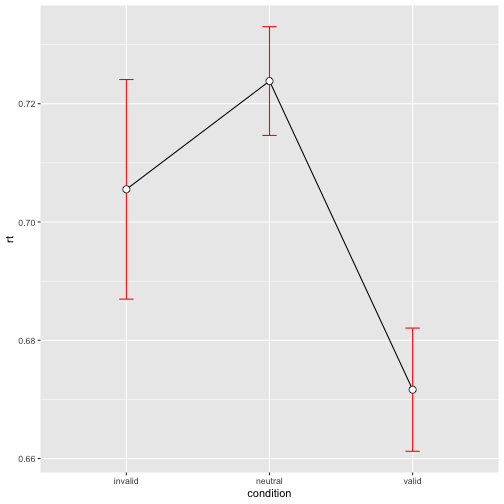


```r
library(patchwork)
```


```r
p_accuracy / p_rt
```

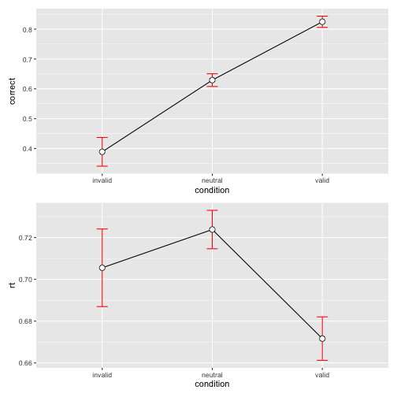

